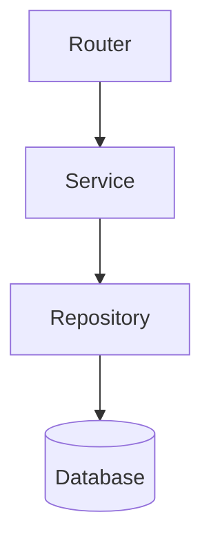

# Area Deep Dive Analysis

Generate a focused, detailed analysis report for a specific area of the codebase. Unlike the health check (broad/shallow) or project report (external/summary), this goes deep into one subsystem.

## When to Use

- Investigating a specific feature before modifying it
- Understanding a subsystem's architecture for a new team member
- Pre-refactoring analysis to map dependencies
- Debugging systemic issues in one area
- When the user points at a part of the codebase and says "explain this" or "analyze this"

## Supported Areas

The user specifies which area to analyze. Common targets:

| Area | Scope |
|------|-------|
| `backend` | Full backend: models, services, repos, workers |
| `frontend` | Full frontend: components, features, routing, state |
| `auth` | Authentication flow end-to-end (BE + FE) |
| `database` | Models, migrations, queries, indexes |
| `api` | API routes, schemas, middleware, error handling |
| `{feature}` | Any specific feature (e.g., `roadmaps`, `chat`, `actionkit`) |
| `infra` | Docker, CI/CD, deployment, environment config |
| `tests` | Test structure, coverage gaps, patterns |

If the user doesn't specify, ask: "Which area should I deep dive into?"

## Analysis Process

### Step 1: Map the Area

Identify all files belonging to the target area. Use Glob and Grep to build a file map.

**For a feature (e.g., `roadmaps`):**
```
app/features/roadmaps/          — domain models, services
app/api/v1/roadmaps/            — HTTP routes
app/repositories/*roadmap*      — data access
app/models/roadmap.py           — ORM models
tests/**/test_roadmap*          — tests
app-frontend/src/features/roadmaps/  — frontend (if exists)
```

**For a layer (e.g., `database`):**
```
app/models/                     — all ORM models
app/repositories/               — all repositories
app/core/db.py                  — session factory
alembic/versions/               — migrations
```

### Step 2: Analyze

For each area, examine these dimensions:

**Architecture**
- Directory structure and organization
- Key classes/functions and their responsibilities
- Dependency graph (what imports what)
- Design patterns used (repository pattern, service layer, etc.)

**Data Flow**
- How data enters the system (API routes, events, cron)
- How it's transformed (services, business logic)
- How it's persisted (repositories, models)
- How it exits (responses, SSE, files)

**Code Quality**
- Consistency with project conventions
- Error handling patterns
- Type safety (type hints, validation)
- Duplication or unnecessary complexity

**Test Coverage**
- Which parts have tests
- Which parts lack tests
- Test quality (mocking strategy, assertions)

**Dependencies**
- Internal dependencies (other features/modules)
- External dependencies (libraries, APIs)
- Coupling assessment (tight vs. loose)

**Risks & Technical Debt**
- Known issues or workarounds
- Fragile code (complex conditionals, deep nesting)
- Missing validation or error handling
- Performance concerns

### Step 3: Generate Report

Save to `docs/plans/reports/REPORT-deep-dive-{area}-{YYYY-MM-DD}.md`:

```markdown
# Deep Dive: {Area Name}

> **Date:** {date}
> **Scope:** {description of what was analyzed}
> **Files analyzed:** {count}

---

## Overview

{2-3 sentences: what this area does and its role in the system}

## File Map

{Tree or table of all files in this area with brief descriptions}

| File | Lines | Role |
|------|-------|------|
| `path/to/file.py` | {N} | {brief description} |

## Architecture

{Describe the structure, patterns, and key design decisions}

### Component Diagram

{If helpful, include a Mermaid diagram showing relationships}



## Data Flow

{Describe how data moves through this area, with concrete examples}

**Example: {Use Case}**
1. {Step 1}
2. {Step 2}
3. ...

## Code Quality Assessment

| Aspect | Rating | Notes |
|--------|--------|-------|
| Structure consistency | {GREEN/YELLOW/RED} | {brief} |
| Error handling | {GREEN/YELLOW/RED} | {brief} |
| Type safety | {GREEN/YELLOW/RED} | {brief} |
| Duplication | {GREEN/YELLOW/RED} | {brief} |

## Test Coverage

| Component | Tested | Gaps |
|-----------|--------|------|
| {component} | {yes/partial/no} | {what's missing} |

## Dependencies

### Internal
- {module} — {why it depends on it}

### External
- {library} — {what it's used for}

## Risks & Technical Debt

1. **{Risk}** — {description and impact}
2. **{Risk}** — {description and impact}

## Recommendations

| Priority | Action | Effort | Impact |
|----------|--------|--------|--------|
| P0 | {action} | {S/M/L} | {description} |
| P1 | {action} | {S/M/L} | {description} |

---

*Generated by Claude Code on {date}*
```

## Key Principles

- **Depth over breadth**: This is the deep dive. Read the actual code, don't just list files. Understand the logic, not just the structure.
- **Concrete examples**: Show actual code paths, not abstract descriptions. "When a user creates a roadmap, the flow is POST /roadmaps/jobs → RoadmapGenerationService.generate() → ARQ worker" is useful.
- **Mermaid diagrams**: Use them for complex relationships. A diagram replaces a paragraph of text.
- **Actionable findings**: Every risk or issue should have a recommended action. "This function is 200 lines long" is an observation; "Extract the validation logic (lines 45-90) into a separate method" is actionable.
- **Respect scope**: Don't analyze the entire project. Stay focused on the requested area. If you discover cross-cutting concerns, note them briefly and suggest a separate deep dive.
