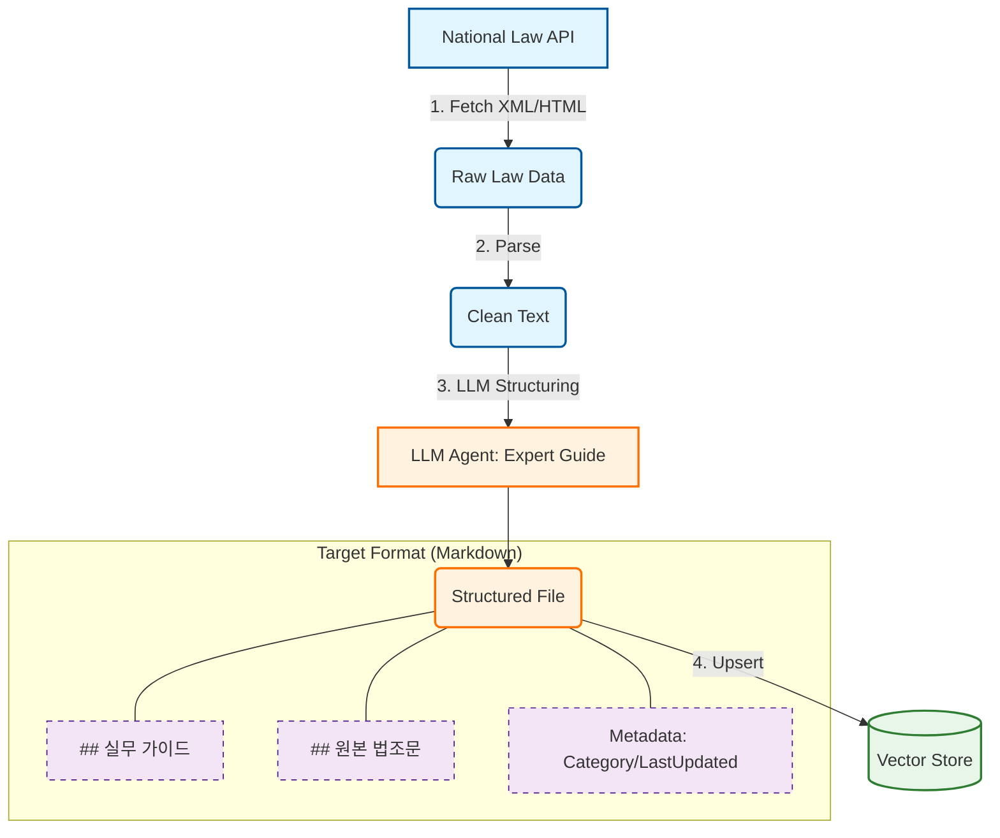

# PLAN-rag-api-sync: 법령 API 기반 실시간 동기화 RAG 구축 계획

> **Project Goal**: 국가법령정보센터 Open API를 통해 최신 법령 데이터를 주기적으로 동기화(Sync)하고, 이를 '실무 가이드' 포맷으로 자동 구조화(ETL)하여 고품질/최신성을 모두 갖춘 RAG 서비스를 구축한다. (Option B 전략)

---

## 🏗️ Architecture: "The API-Driven Pipeline"

---

## 📅 Phase 1: API Integration & Target Definition (Day 1)
**목표**: 국가법령정보센터 API 연동 성공 및 수집 대상 리스트 확정.

- [ ] **API Setup**: 국가법령정보센터 Open API 키 발급 및 `GetLawDetail` 오퍼레이션 테스트.
- [ ] **Target List Definition**: 서비스에 필요한 핵심 법령 리스트(`target_laws.json`) 정의.
    - 예: `["식품위생법", "건축법", "소방시설법", "다중이용업소법", ...]` (약 50개)
- [ ] **Fetcher Script (`scripts/fetch_laws.py`)**:
    - 리스트 순회하며 XML 데이터 다운로드.
    - 캐싱(Caching) 로직: `last_modified` 비교하여 변경된 법령만 다운로드.

## 📅 Phase 2: Structural ETL Pipeline (Day 2)
**목표**: 다운로드한 Raw XML을 '사람이 읽기 좋은 가이드'로 변환.

- [ ] **XML Parser**: 복잡한 법령 XML 트리(`조 > 항 > 호 > 목`)를 평문 텍스트 블록으로 변환.
- [ ] **LLM Guide Generation**:
    - Input: 파싱된 법령 텍스트 (e.g., 식품위생법 제37조 영업허가).
    - Prompt: "이 조항을 읽고, 예비 창업자가 해야 할 행동(Action) 위주로 '실무 가이드'를 작성해줘."
    - Output: Markdown 분리 (`## 실무 가이드` vs `## 원본`).
- [ ] **Batch Processor**: 전체 타겟 법령에 대해 변환 작업 수행 및 `data/knowledge_base/` 저장.

## 📅 Phase 3: Vector Store Sync (Day 3)
**목표**: 변환된 데이터를 벡터 DB에 반영하고 검색 가능하게 만들기.

- [ ] **Embedder**: `Target Format`의 `## 실무 가이드` 섹션(High Weight)과 `## 원본 법조문`(Low Weight)을 분리 임베딩.
- [ ] **Sync Logic**:
    - 매일 1회(00:00) Fetcher 실행.
    - 변경 감지 시 -> LLM 재변환 -> Vector DB 업데이트(Upsert).
- [ ] **Metadata Tagging**: `LawName`, `ArticleNo`, `LastUpdated` 등 필수 태그 삽입.

## 📅 Phase 4: Verification & Scheduler (Day 4)
**목표**: 자동화 파이프라인 안정성 검증.

- [ ] **Scheduler**: GitHub Actions 또는 Cron으로 일일 배치 작업 등록.
- [ ] **Search Test**: "최신 개정된 소방 법규 반영됐어?" 등 시점 관련 질문 테스트.
- [ ] **Quality Check**: LLM이 생성한 '실무 가이드'가 원본 법령을 왜곡하지 않는지 샘플 검수.

---

## ✅ Checklist (Definition of Done)
1. 국가법령정보센터 API를 통해 지정된 법령 50개를 모두 가져올 수 있는가?
2. XML 데이터가 `[가이드] + [원본]` 형태의 Markdown으로 깔끔하게 변환되는가?
3. 법령이 개정되었을 때, 시스템이 이를 감지하고 DB를 갱신하는가?
