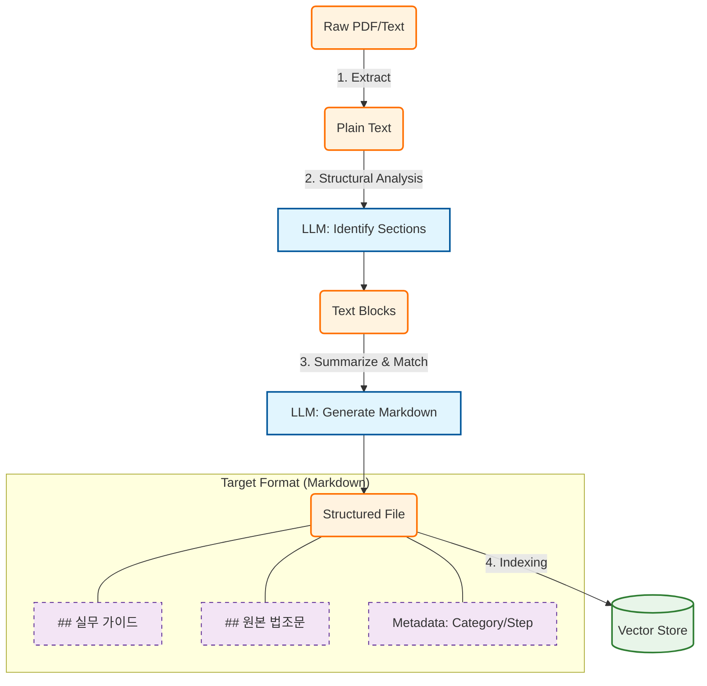

# PLAN-rag-automation: 법률 데이터 자동 구조화형 RAG 구축 계획

> **Project Goal**: '휴게음식점' 등 비정형(PDF) 법률 데이터를 '일반음식점' 수준의 고품질 구조화(Markdown) 데이터로 자동 변환(ETL)하여, 업종과 무관하게 균일한 고성능 RAG 서비스를 구축한다. (Option A 전략)

---

## 🏗️ Architecture: "The Structuring Pipeline"

---

## 📅 Phase 1: Prototype & Prompt Engineering (Day 1)
**목표**: 파일 1개를 완벽하게 변환하는 프롬프트와 로직 검증.

- [ ] **Data Analysis**: `휴게음식점` PDF와 `일반음식점` Markdown을 비교하여 **Target Schema** 확정.
- [ ] **Prompt Design**:
    - Role: "너는 20년차 요식업 행정 전문가야."
    - Task: "이 법령 텍스트를 읽고, 창업자가 알아야 할 '핵심 액션'과 '근거 조항'으로 분리해."
    - Output: Markdown Format (`## 실무 가이드`, `## 원본 법조문`).
- [ ] **Prototype Script (`scripts/rag_prototype.py`)**:
    - PDF 텍스트 추출 (PyPDF2 or Unstructured).
    - LLM(OpenAI/Anthropic) 호출.
    - 결과 저장 및 육안 검증.

## 📅 Phase 2: Batch ETL Pipeline (Day 2)
**목표**: 전체 `.temp/` 디렉토리를 순회하며 지식 베이스(Knowledge Base) 구축.

- [ ] **Directory Crawler**: 재귀적으로 폴더를 탐색하며 처리 대상 파일 식별.
- [ ] **Metadata Extraction**: 파일 경로(`휴게음식점/영업신고/...`)를 파싱하여 `Category`, `Step` 태그 생성.
- [ ] **Concurrent Processing**: 속도 향상을 위한 비동기(Async) 배치 처리 구현.
- [ ] **Error Handling**: 토큰 초과, 파싱 실패 시 재시도 또는 에러 로그(`files_failed.log`) 기록.
- [ ] **Artifact Generation**: 최종 변환된 파일들을 `data/knowledge_base/` 구조로 저장.

## 📅 Phase 3: RAG Service Integration (Day 3)
**목표**: 구조화된 데이터를 벡터 DB에 적재하고 검색 로직 구현.

- [ ] **Dual Indexing Strategy 적용**:
    - `Guide Index`: 사용자의 자연어 질문 매칭용 (가중치 High).
    - `Law Index`: 정확한 법적 근거 검색용.
- [ ] **Search Logic Update**:
    - 사용자 질문에서 '업종(Category)'과 '단계(Step)' 의도 파악.
    - Metadata Filtering 적용 (`filter={category="휴게음식점"}`).
- [ ] **Answer Generation**: "가이드를 먼저 설명하고, 법적 근거를 인용(Citation)하는" 답변 템플릿 적용.

## 📅 Phase 4: Verification & UI (Day 4)
**목표**: 실제 질문 테스트 및 신뢰성 검증.

- [ ] **Test Set 구축**: "휴게음식점 입지 조건이 뭐야?", "소방 필증 필요해?" 등 예상 질문 20개.
- [ ] **Evaluation**:
    - Raw PDF 검색 결과 vs 구조화 데이터 검색 결과 비교.
    - 할루시네이션(없는 조항 날조) 여부 체크.
- [ ] **Traceability**: 답변에 사용된 출처 파일(`.../건축법.md`)이 UI에 잘 뜨는지 확인.

---

## ✅ Checklist (Definition of Done)
1. `.temp/` 하위의 모든 유효한 법률 파일이 Markdown으로 변환되었는가?
2. 변환된 Markdown이 `[가이드]`와 `[법조문]`으로 명확히 구분되는가?
3. RAG 질문 시, 올바른 업종의 파일을 찾아내는가? (예: 휴게음식점 질문에 일반음식점 답 안 하기)
