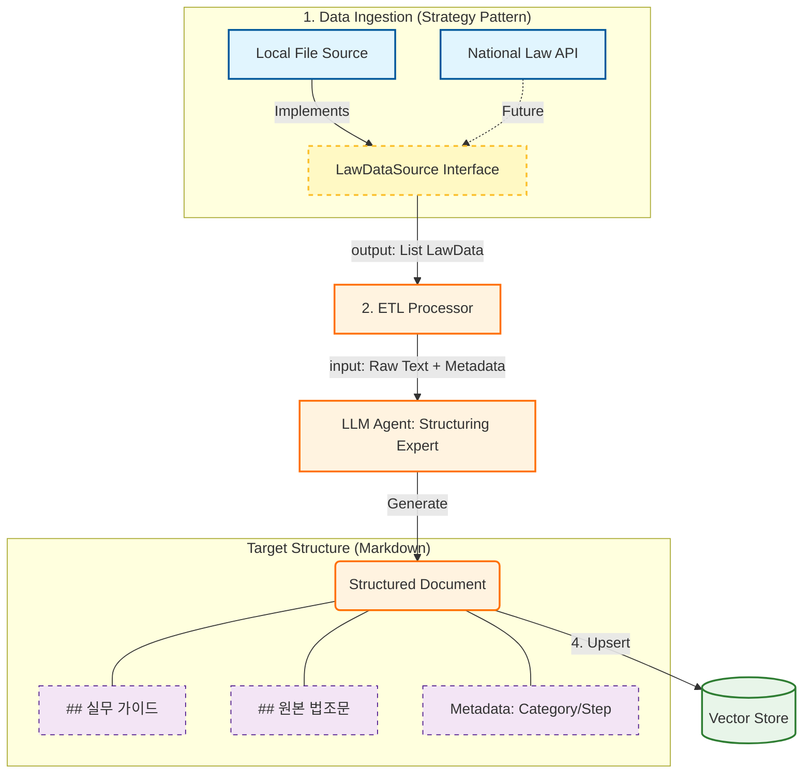

# PLAN-rag-hybrid-rollout: 하이브리드 RAG 구축 계획 (Local First -> API Sync)

> **Project Goal**: 초기에는 로컬 샘플 데이터(`.temp/`)로 빠르게 RAG를 구축하여 기능을 검증하고, 추후 구조 변경 없이 데이터 소스만 '국가법령정보센터 API'로 교체할 수 있는 유연한 아키텍처를 구현한다.

---

## 🏗️ Architecture: "Source-Agnostic Pipeline"

핵심은 **'데이터 수집(Fetch)'과 '데이터 가공(Process)'의 분리**입니다.

---

## 📅 Phase 1: Local Ingestion & Core Logic (Current Scope)
**목표**: `.temp/` 디렉토리의 파일을 읽어 RAG를 구축하되, 추후 API 연동을 고려한 인터페이스 설계.

### Step 1.1: Abstract Interface Design
- [ ] **`app/services/law_fetcher.py` 정의**:
    - `class LawDataSource(ABC)`: 데이터 소스 추상 클래스.
    - `fetch_all_laws() -> List[LawData]`: 공통 반환 모델 정의.
- [ ] **Data Model (`LawData`)**:
    - `title`, `category`, `content_body`, `source_type` (LOCAL/API).

### Step 1.2: Local Implementation
- [ ] **`LocalFileSource` 구현**:
    - `.temp/` 하위의 PDF/Markdown 파일을 읽는 로직.
    - 경로 파싱(`휴게음식점/영업신고`)을 통해 초기 메타데이터 생성.

### Step 1.3: Shared Structuring Logic (The Core)
- [ ] **LLM Processing Pipeline**:
    - PDF/Text -> **LLM** -> `[실무 가이드] + [원본]` 변환.
    - 프롬프트 엔지니어링: "이 법령을 창업자 가이드로 변환해라."
    - **중요**: 이 로직은 소스가 Local이든 API든 동일하게 동작해야 함.

### Step 1.4: Vector Store Integration
- [ ] **ChromaDB / Supabase Vector** 연동.
- [ ] **Dual Indexing**: 가이드(설명)와 원본(레퍼런스)을 분리하여 임베딩.

---

## 📅 Phase 2: API Switch-Over (Future Scope)
**목표**: `LocalFileSource`를 `MolegApiSource`로 교체하여 실시간성 확보.

### Step 2.1: API Fetcher Implementation
- [ ] **`MolegApiSource` 구현**: (Phase 1의 인터페이스 상속)
    - 국가법령정보센터 API 호출 -> XML 파싱 -> `LawData` 모델로 변환.
- [ ] **Dependency Injection**: 설정(`CONFIG`) 한 줄 변경으로 소스 교체.

### Step 2.2: Scheduler & Sync
- [ ] 일일 배치(Cron)로 `fetch_all_laws()` 실행.
- [ ] `last_updated` 비교하여 변경된 법령만 재처리(Re-structuring).

---

## ✅ Checklist (Phase 1 Definition of Done)
1. `LawDataSource` 인터페이스가 정의되었는가? (API 확장이 가능한 구조인가?)
2. `.temp/`의 `휴게음식점(PDF)` 파일이 자동으로 `[가이드]` 형태로 변환되어 검색되는가?
3. RAG 질문 시 "어떤 파일(출처)을 참고했는지" 정확히 나오는가?
