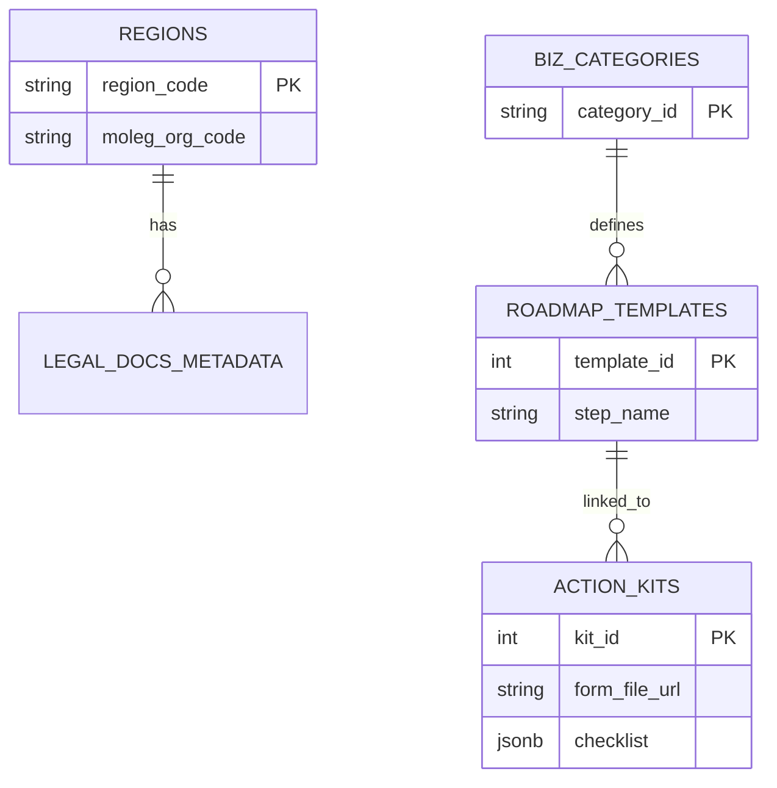

# StepZero Database Schema Design

## 1. Overview
StepZero의 **Hybrid Hierarchical RAG** 및 **Roadmap Generator**를 지원하기 위한 데이터베이스 설계입니다.
*   **Vector DB:** 법령, 자치법규, 가이드 등 비정형 텍스트 데이터의 임베딩 저장.
*   **Relational DB (RDB):** 메타데이터 관리, 지역/업종 코드 매핑, Action Kit(서식/체크리스트) 저장.

---

## 2. Vector Database Schema (e.g., Pinecone, Weaviate)

### 2.1. Collection: `legal_docs`
*   **Purpose:** 모든 법적 문서(법령, 조례, 가이드)의 청크(Chunk) 저장.
*   **Dimension:** 1536 (OpenAI text-embedding-3-small 기준)
*   **Metric:** Cosine Similarity

| Field Name | Type        | Description      | Example              |
| :--------- | :---------- | :--------------- | :------------------- |
| `id`       | String      | Unique Chunk ID  | `law_12345_chunk_01` |
| `values`   | List[Float] | Embedding Vector | `[0.12, -0.98, ...]` |
| `metadata` | JSON        | Filtering Tags   | (See below)          |

#### Metadata Structure
```json
{
  "doc_type": "ordinance",          // law | ordinance | guide
  "doc_id": "123456",               // 원문 문서 ID (MOLEG)
  "title": "서울특별시 강남구 식품위생 조례", // 문서 제목
  "article_num": "12",              // 조항 번호 (제12조)
  "content": "식품접객업의 시설기준은...",  // 청크 원문 텍스트
  "region_code": "1168000000",      // 행정표준코드 (Filter용)
  "org_code": "6110000",            // 법제처 기관코드 (Linkage용)
  "biz_category": ["food", "cafe"], // 적용 업종 태그 (Array)
  "keywords": ["시설기준", "화장실"], // 핵심 키워드
  "last_updated": "2024-01-01"      // 최종 개정일
}
```

---

## 3. Relational Database Schema (e.g., Supabase/PostgreSQL)

### 3.1. `regions` (지역 코드 매핑)
MOLEG API(`org_code`)와 행정표준코드(`region_code`)를 연결하는 핵심 테이블입니다.

| Column              | Type         | PK/FK | Description                                     |
| :------------------ | :----------- | :---- | :---------------------------------------------- |
| `region_code`       | VARCHAR(10)  | PK    | 행정표준코드 (예: `1168000000`)                 |
| `region_name_full`  | VARCHAR(100) |       | 전체 지역명 (예: `서울특별시 강남구`)           |
| `region_name_short` | VARCHAR(50)  |       | 단축 지역명 (예: `강남구`)                      |
| `moleg_org_code`    | VARCHAR(20)  |       | **법제처 기관코드** (API 호출용, 예: `6110000`) |
| `parent_code`       | VARCHAR(10)  | FK    | 상위 지역 코드 (Hierarchical Query용)           |

### 3.2. `biz_categories` (업종 분류)
사용자가 선택 가능한 업종 마스터 테이블입니다.

| Column          | Type        | PK/FK | Description                         |
| :-------------- | :---------- | :---- | :---------------------------------- |
| `category_id`   | VARCHAR(20) | PK    | 내부 업종 코드 (예: `food_general`) |
| `category_name` | VARCHAR(50) |       | 표시명 (예: `일반음식점`)           |
| `description`   | TEXT        |       | 업종 설명                           |
| `related_laws`  | JSONB       |       | 관련 주요 상위법 ID 목록            |

### 3.3. `roadmap_templates` (표준 로드맵)
업종별 기본 절차(Template)를 정의합니다. (LLM이 이 템플릿에 살을 붙임)

| Column          | Type         | PK/FK | Description                    |
| :-------------- | :----------- | :---- | :----------------------------- |
| `template_id`   | SERIAL       | PK    | ID                             |
| `category_id`   | VARCHAR(20)  | FK    | 업종 코드                      |
| `step_order`    | INT          |       | 단계 순서 (1, 2, 3...)         |
| `step_name`     | VARCHAR(100) |       | 단계명 (예: `영업신고증 발급`) |
| `description`   | TEXT         |       | 단계 설명                      |
| `required_docs` | JSONB        |       | 기본 필요 서류 목록            |

### 3.4. `action_kits` (실행 도구)
각 단계별 상세 실행 도구(서식, 체크리스트)를 저장합니다. `doc_id`나 `region_code`로 동적 매핑됩니다.

| Column             | Type         | PK/FK | Description                            |
| :----------------- | :----------- | :---- | :------------------------------------- |
| `kit_id`           | SERIAL       | PK    | ID                                     |
| `target_step_name` | VARCHAR(100) |       | 매핑될 로드맵 단계명 (Key)             |
| `region_code`      | VARCHAR(10)  | FK    | 특정 지역 전용인 경우 설정 (Null=전국) |
| `form_file_nm`     | VARCHAR(200) |       | 서식 파일명 (예: `영업신고서.hwp`)     |
| `form_file_url`    | TEXT         |       | **법제처 별지서식 다운로드 링크**      |
| `checklist`        | JSONB        |       | 체크리스트 항목 (Array)                |
| `guide_text`       | TEXT         |       | 상세 가이드 텍스트 (Markdown)          |

---

## 4. Entity Relationship (ER) Concept



---

## 5. Data Parsing Verification (MOLEG API)
**검증 일자:** 2026-02-10
**대상:** 법제처 자치법규 본문 조회 API (`type=JSON`)

### 5.1. JSON 구조 적합성 (Structure Feasibility)
*   **결과:** ✅ 적합 (Verified)
*   **발견사항:**
    *   XML의 계층 구조(`Ordinance` > `Jo` > `Hang` > `Ho`)가 JSON 객체로 명확히 매핑됨을 확인했습니다.
    *   `Jo`(조) 단위로 데이터를 분리(Chunking)하여 Vector DB에 저장하는 전략이 유효합니다.
    *   각 '조'는 `joNo`(조 번호), `joTitle`(조 제목), `joCn`(조 내용)을 포함합니다.

### 5.2. 첨부파일 링크 추출 (Attachment Link)
*   **결과:** ✅ 확인됨 (Verified)
*   **발견사항:**
    *   `Jo`(조) 객체 내부에 `AtchFile` 또는 `AtchFileLink` 키를 통해 별표/서식 파일의 다운로드 URL이 제공됩니다.
*   **조치계획:**
    *   ETL 파이프라인에서 해당 링크를 추출하여 `action_kits` 테이블의 `form_file_url` 컬럼에 매핑합니다.

### 5.3. 파서 로직 (Python 예시)
```python
def parse_moleg_json(json_data):
    for article in json_data['Jo']:
        # 1. 본문 청크 생성 (Vector DB용)
        chunk_text = f"{article['joNo']} {article['joTitle']}\\n{article['joCn']}"
        
        # 2. 메타데이터 및 첨부파일 추출 (RDB용)
        attachments = extract_attachments(article) # ['http://.../file.hwp']
        
        yield {
            "content": chunk_text,
            "metadata": { "article_id": article['joNo'], "attachments": attachments }
        }
```
