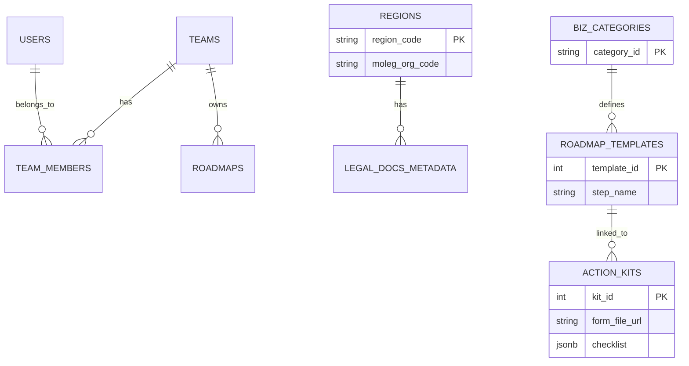

# StepZero Database Schema Design (v1.2 - Enterprise Ready & Detailed)

## 1. Overview
StepZero의 **안정성(Audit Trail)**, **B2B 확장성(Multi-Tenancy)**, 그리고 **Rag/Roadmap Core Logic**을 모두 반영한 데이터베이스 설계입니다.
*   **Design Principle:**
    *   **Auditability:** 모든 테이블에 생성/수정/삭제 이력(`created_at`, `updated_at`, `deleted_at`)을 남겨 데이터 복구 및 추적 가능.
    *   **Multi-Tenancy:** 모든 비즈니스 데이터는 **'사용자(User)'가 아닌 '팀(Team)'**에 소속되어 향후 협업 및 기업용 서비스 확장 용이.

---

## 2. Common Standards (Audit Columns)
모든 RDB 테이블은 아래 컬럼들을 기본적으로 포함해야 합니다. (Mixin/BaseModel 처리)

| Column       | Type        | Default | Description                                 |
| :----------- | :---------- | :------ | :------------------------------------------ |
| `created_at` | TIMESTAMPTZ | NOW()   | 생성 일시                                   |
| `updated_at` | TIMESTAMPTZ | NOW()   | 최종 수정 일시 (Trigger로 자동 갱신)        |
| `deleted_at` | TIMESTAMPTZ | NULL    | **Soft Delete** (값이 있으면 삭제된 데이터) |
| `created_by` | UUID        | NULL    | 생성자 ID (System인 경우 NULL)              |
| `updated_by` | UUID        | NULL    | 수정자 ID                                   |

---

## 3. Identity & Access Management (IAM)

### 3.1. `users` (Global User Identity)
인증(Authentication) 주체입니다. 자체 JWT 인증을 위한 기본 정보를 저장합니다.

| Column          | Type         | PK/FK  | Description                     |
| :-------------- | :----------- | :----- | :------------------------------ |
| `id`            | UUID         | PK     | User ID (System Generated)      |
| `email`         | VARCHAR      | Unique | 이메일                          |
| `password_hash` | VARCHAR      |        | **bcrypt/argon2 해시값** (필수) |
| `full_name`     | VARCHAR(100) |        | 사용자 실명                     |
| `avatar_url`    | TEXT         |        | 프로필 이미지 URL               |
| `is_active`     | BOOLEAN      |        | 계정 활성화 여부                |
| *(Audit)*       | ...          |        | created_at, updated_at...       |

### 3.2. `teams` (Tenants / Workspaces)
데이터 소유의 주체입니다. **개인 사용자도 1인 Team을 자동 생성**하여 사용합니다.

| Column      | Type         | PK/FK | Description                         |
| :---------- | :----------- | :---- | :---------------------------------- |
| `id`        | UUID         | PK    | Team ID                             |
| `name`      | VARCHAR(100) |       | 팀 이름 (예: 김철수의 워크스페이스) |
| `plan_type` | VARCHAR(20)  |       | `FREE`, `PRO`, `ENTERPRISE`         |
| *(Audit)*   | ...          |       |                                     |

### 3.3. `team_members` (Roles & Permissions)
사용자와 팀 간의 N:M 관계 및 권한을 관리합니다.

| Column    | Type        | PK/FK | Description                          |
| :-------- | :---------- | :---- | :----------------------------------- |
| `team_id` | UUID        | FK    | Team ID                              |
| `user_id` | UUID        | FK    | User ID                              |
| `role`    | VARCHAR(20) |       | `OWNER`, `ADMIN`, `MEMBER`, `VIEWER` |
| *(Audit)* | ...         |       |                                      |

---

## 4. Core Business Domain

### 4.1. `roadmaps` (User Generated Roadmaps)
사용자(팀)가 생성한 창업 로드맵 인스턴스입니다.

| Column        | Type         | PK/FK | Description                        |
| :------------ | :----------- | :---- | :--------------------------------- |
| `id`          | UUID         | PK    | Roadmap ID                         |
| `team_id`     | UUID         | FK    | **소유 팀 ID (Multi-Tenancy Key)** |
| `title`       | VARCHAR(200) |       | 로드맵 제목 (예: 강남구 카페 창업) |
| `region_code` | VARCHAR(10)  | FK    | 선택된 지역 코드                   |
| `category_id` | VARCHAR(20)  | FK    | 선택된 업종 코드                   |
| `status`      | VARCHAR(20)  |       | `DRAFT`, `ACTIVE`, `COMPLETED`     |
| *(Audit)*     | ...          |       |                                    |

### 4.2. `roadmap_steps` (Steps within a Roadmap)
로드맵의 개별 단계입니다. 생성 시 템플릿에서 복사되어 생성됩니다.

| Column       | Type         | PK/FK | Description                      |
| :----------- | :----------- | :---- | :------------------------------- |
| `id`         | UUID         | PK    | Step ID                          |
| `roadmap_id` | UUID         | FK    | Roadmap ID                       |
| `step_order` | INT          |       | 단계 순서                        |
| `title`      | VARCHAR(100) |       | 단계명                           |
| `status`     | VARCHAR(20)  |       | `PENDING`, `IN_PROGRESS`, `DONE` |
| `due_date`   | DATE         |       | 완료 예정일                      |
| *(Audit)*    | ...          |       |                                  |

### 4.3. `template_roadmaps` (System Master Data)
업종별 표준 로드맵 템플릿입니다. (시스템 관리자가 관리)

| Column        | Type         | PK/FK | Description                     |
| :------------ | :----------- | :---- | :------------------------------ |
| `id`          | SERIAL       | PK    | Template ID                     |
| `category_id` | VARCHAR(20)  | FK    | 업종 코드                       |
| `title`       | VARCHAR(200) |       | 템플릿 제목                     |
| `version`     | INT          |       | 템플릿 버전 (v1, v2...)         |
| `is_active`   | BOOLEAN      |       | 현재 사용 여부                  |
| `steps_json`  | JSONB        |       | 단계 구성 정의 (Array of Steps) |
| *(Audit)*     | ...          |       |                                 |

### 4.4. `action_kits` (실행 도구)
각 단계별 상세 실행 도구(서식, 체크리스트)를 저장합니다. `doc_id`나 `region_code`로 동적 매핑됩니다.

| Column             | Type         | PK/FK | Description                            |
| :----------------- | :----------- | :---- | :------------------------------------- |
| `kit_id`           | SERIAL       | PK    | ID                                     |
| `target_step_name` | VARCHAR(100) |       | 매핑될 로드맵 단계명 (Key)             |
| `region_code`      | VARCHAR(10)  | FK    | 특정 지역 전용인 경우 설정 (Null=전국) |
| `form_file_nm`     | VARCHAR(200) |       | 서식 파일명 (예: `영업신고서.hwp`)     |
| `form_file_url`    | TEXT         |       | **법제처 별지서식 다운로드 링크**      |
| `checklist`        | JSONB        |       | 체크리스트 항목 (Array)                |
| `guide_text`       | TEXT         |       | 상세 가이드 텍스트 (Markdown)          |

---

## 5. Metadata & Linkage

### 5.1. `regions` (행정구역 코드)
MOLEG API(`org_code`)와 행정표준코드(`region_code`)를 연결하는 핵심 테이블입니다.

| Column              | Type         | PK/FK | Description     |
| :------------------ | :----------- | :---- | :-------------- |
| `region_code`       | VARCHAR(10)  | PK    | 행정표준코드    |
| `region_name_full`  | VARCHAR(100) |       | 전체 지역명     |
| `region_name_short` | VARCHAR(50)  |       | 단축 지역명     |
| `moleg_org_code`    | VARCHAR(20)  |       | 법제처 기관코드 |
| `parent_code`       | VARCHAR(10)  | FK    | 상위 지역 코드  |

### 5.2. `biz_categories` (업종 코드)
| Column         | Type        | PK/FK | Description                 |
| :------------- | :---------- | :---- | :-------------------------- |
| `id`           | VARCHAR(20) | PK    | 업종 ID (예: `cafe`, `gym`) |
| `name`         | VARCHAR(50) |       | 표시명                      |
| `description`  | TEXT        |       | 업종 설명                   |
| `related_laws` | JSONB       |       | 관련 주요 상위법 ID 목록    |

---

## 6. Vector Database Schema (ChromaDB/Pinecone)

### 6.1. Collection: `legal_docs`
*   **Purpose:** 모든 법적 문서(법령, 조례, 가이드)의 청크(Chunk) 저장.
*   **Dimension:** 1536 (OpenAI text-embedding-3-small 기준)
*   **Metric:** Cosine Similarity

| Field Name | Type        | Description      | Example              |
| :--------- | :---------- | :--------------- | :------------------- |
| `id`       | String      | Unique Chunk ID  | `law_12345_chunk_01` |
| `values`   | List[Float] | Embedding Vector | `[0.12, -0.98, ...]` |
| `metadata` | JSON        | Filtering Tags   | (See below)          |

#### Metadata Structure
```json
{
  "doc_type": "ordinance",          // law | ordinance | guide
  "doc_id": "123456",               // 원문 문서 ID (MOLEG)
  "title": "서울특별시 강남구 식품위생 조례", // 문서 제목
  "article_num": "12",              // 조항 번호 (제12조)
  "content": "식품접객업의 시설기준은...",  // 청크 원문 텍스트
  "region_code": "1168000000",      // 행정표준코드 (Filter용)
  "org_code": "6110000",            // 법제처 기관코드 (Linkage용)
  "biz_category": ["food", "cafe"], // 적용 업종 태그 (Array)
  "keywords": ["시설기준", "화장실"], // 핵심 키워드
  "last_updated": "2024-01-01"      // 최종 개정일
}
```

---

## 7. Entity Relationship (ER) Concept
(Teams와 Roadmaps 관계 추가)



---

## 8. Data Parsing Verification (MOLEG API)
**검증 일자:** 2026-02-10
**대상:** 법제처 자치법규 본문 조회 API (`type=JSON`)

### 8.1. JSON 구조 적합성 (Structure Feasibility)
*   **결과:** ✅ 적합 (Verified)
*   **발견사항:**
    *   XML의 계층 구조(`Ordinance` > `Jo` > `Hang` > `Ho`)가 JSON 객체로 명확히 매핑됨을 확인했습니다.
    *   `Jo`(조) 단위로 데이터를 분리(Chunking)하여 Vector DB에 저장하는 전략이 유효합니다.
    *   각 '조'는 `joNo`(조 번호), `joTitle`(조 제목), `joCn`(조 내용)을 포함합니다.

### 8.2. 첨부파일 링크 추출 (Attachment Link)
*   **결과:** ✅ 확인됨 (Verified)
*   **발견사항:**
    *   `Jo`(조) 객체 내부에 `AtchFile` 또는 `AtchFileLink` 키를 통해 별표/서식 파일의 다운로드 URL이 제공됩니다.
*   **조치계획:**
    *   ETL 파이프라인에서 해당 링크를 추출하여 `action_kits` 테이블의 `form_file_url` 컬럼에 매핑합니다.

### 8.3. 파서 로직 (Python 예시)
```python
def parse_moleg_json(json_data):
    for article in json_data['Jo']:
        # 1. 본문 청크 생성 (Vector DB용)
        chunk_text = f"{article['joNo']} {article['joTitle']}\\n{article['joCn']}"
        
        # 2. 메타데이터 및 첨부파일 추출 (RDB용)
        attachments = extract_attachments(article) # ['http://.../file.hwp']
        
        yield {
            "content": chunk_text,
            "metadata": { "article_id": article['joNo'], "attachments": attachments }
        }
```
