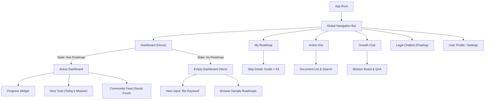

# StepZero Information Architecture (IA)

## 1. Overview
StepZero의 메뉴 구조(IA)는 **Option B (Dashboard-Centric with Empty State Hero)** 전략을 기반으로 합니다.
이는 사용자에게 **"지금 당장 실행할 일(Actionable Item)"**을 명확히 제시하고, 서비스의 핵심 가치인 **로드맵(Roadmap)**, **실행 도구(Action Kits)**, **커뮤니티(Community)**를 유기적으로 연결하는 구조입니다.

특히 **Cold Start (초기 진입)** 시, 빈 화면 대신 강력한 **[Action-First]** 경험을 제공하여 이탈을 방지하고 즉각적인 로드맵 생성을 유도합니다.

---

## 2. Sitemap (Structure)

---

## 3. Detailed Page Structure

### 3.1. Dashboard (Home) - The Hub
사용자의 상태(State)에 따라 **두 가지 모드**로 전환되는 핵심 페이지입니다.

#### Mode A: Cold Start (No Roadmap) - "Hero Focus"
*   **Goal:** 사용자가 고민 없이 즉시 로드맵을 생성하도록 유도.
*   **Layout:**
    *   **Header:** 로고(Left), 로그인 정보(Right)만 노출. 메뉴 최소화.
    *   **Main (Center):**
        *   **Headline:** "대표님, 어떤 사업을 준비 중이신가요?" (Large Typography)
        *   **Input Field:** "예: 성수동 카페, 온라인 의류 쇼핑몰" (Auto-focus)
        *   **CTA Button:** [무료 로드맵 생성하기 ✨] (Primary Color, Large)
    *   **Bottom (Trust):** "지금 1,240명의 예비 창업자가 로드맵을 실행 중입니다." (Ticker/Banner)
    *   **Preview:** 입력창 하단에 [인기 로드맵 미리보기] 카드 배치 (카페, 식당, 쇼핑몰 등).

#### Mode B: Active Dashboard (Has Roadmap) - "Command Center"
*   **Goal:** 현재 진행 상황을 파악하고, 다음 할 일을 실행.
*   **Layout:**
    *   **Top Widget (Progress):** 전체 진행률(%), 현재 단계(Step N), D-Day.
    *   **Main Widget (Next Action):** 가장 시급한 할 일 (예: "영업신고증 수령"). [실행하기] 버튼 포함.
    *   **Sub Widget (Community):** 같은 단계 동료들의 실시간 인증샷 (Social Motivation).
    *   **Recommend:** 현재 단계에 필요한 Action Kit 바로가기 (예: 임대차 계약서).

### 3.2. My Roadmap (Timeline View)
*   **Goal:** 전체적인 창업 여정(Journey)을 조망하고 세부 단계 관리.
*   **Layout:**
    *   **Timeline:** 수직(Vertical) 또는 지하철 노선도 형태의 UI.
    *   **Node Status:**
        *   🔵 **Active:** 현재 단계 (Pulse 효과).
        *   🟢 **Completed:** 완료된 단계 (체크 표시).
        *   ⚪ **Locked:** 미래 단계 (비활성/잠금).
    *   **Interaction:** 노드 클릭 시 우측(PC) 또는 하단(Mobile)에 **[Step Detail Panel]** 열림.
        *   **Detail Panel:** 단계 설명, 필수 서류(Action Kit) 다운로드 링크, 법적 근거(RAG), [완료 체크] 버튼.

### 3.3. Action Kits (Library)
*   **Goal:** 필요한 서류와 가이드를 빠르게 검색하고 다운로드.
*   **Layout:**
    *   **Search Bar:** 키워드 검색 (예: "위생교육", "임대차").
    *   **Category Filter:** [전체] / [공통 필수] / [내 업종 전용].
    *   **List Item:** 문서 아이콘, 제목, 다운로드 버튼(HWP/PDF), [미리보기] 버튼.

### 3.4. Growth Club (Community)
*   **Goal:** 동료들과 함께 실행하고 인증하며 동기 부여.
*   **Layout:**
    *   **Stage Filter:** [전체] / [준비] / [설립] / [운영] (내 단계 자동 선택).
    *   **Feed:** 인스타그램 스타일의 카드형 UI (사진 + 짧은 글).
    *   **Mission Board:** "오늘의 인증 미션: 사업자등록증 접수증 올리기".

### 3.5. Legal Chatbot (Global Floating)
*   **Goal:** 언제 어디서나 법적 궁금증 해소.
*   **UI:** 우측 하단 둥근 버튼 (FAB). 클릭 시 채팅창 오버레이.
*   **Context Engineering:** 현재 보고 있는 페이지 정보를 함께 전송하여 맞춤형 답변 제공.
    *   *예: '영업신고' 단계에서 질문 시 -> "영업신고 절차에 대해 궁금하신가요?" 선제적 질문.*

---

## 4. User Flow Scenario (Cold Start)

1.  **진입:** 사용자가 로그인. 데이타 없음 감지 -> **[Mode A: Cold Start]** 화면 출력.
2.  **입력:** "강남구 카페" 입력 후 엔터.
3.  **로딩:** "강남구 조례와 식품위생법을 분석 중입니다..." (애니메이션, 3~5초).
4.  **전환:** **[Mode B: Active Dashboard]**로 자동 전환.
5.  **온보딩:** "짜잔! 대표님만의 로드맵이 완성되었습니다. 첫 번째 단계인 [보건증 발급]부터 시작해볼까요?" (툴팁/모달).
6.  **실행:** [보건증 발급] 노드 클릭 -> Action Kit 다운로드 -> 완료 체크 -> 진행률 상승(0% -> 5%).

---

## 5. Mobile Optimization Strategy (Responsive Design)

**Strategy: "Rail & Bottom Hybrid" (Option A)**
모바일에서는 **엄지손가락 친화적(Thumb-Friendly)**인 하단 탭바를 사용하고, PC에서는 **정보 탐색 효율성**을 높이는 사이드바(Side Rail)로 변환하는 표준 반응형 패턴입니다.

### 5.1. Navigation Layout
*   **Mobile (< 768px):** **Bottom Tab Bar** (Fixed)
    *   **Items:** [홈] [로드맵] [액션킷] [클럽] [MY] (5개 아이콘)
    *   **Interaction:** 탭 전환 시 화면 전체 갱신 (또는 부분 갱신).
    *   **FAB:** 우측 하단에 **[챗봇]** 플로팅 버튼 배치.
*   **Tablet/Desktop (>= 768px):** **Left Side Rail / Sidebar**
    *   **Rail (Collapsed):** 아이콘만 노출 (공간 확보).
    *   **Sidebar (Expanded):** 아이콘 + 텍스트 노출 (명확성).
    *   **Header:** 로고 + 검색창 + 알림 + 프로필.

### 5.2. Component Adaptation
| Component       | Mobile View                                                                                                 | Desktop View                                                                                                     |
| :-------------- | :---------------------------------------------------------------------------------------------------------- | :--------------------------------------------------------------------------------------------------------------- |
| **Dashboard**   | **1단 수직 스크롤** (Vertical Stack) Top: [Next Action] 강조 Mid: [Progress] Bot: [Community Feed] | **3단 그리드** (Grid) Left: [Progress] + [Next Action] Center: [Main Chart] Right: [Community] + [Chat] |
| **Roadmap**     | **List View** 노드 터치 시 **Bottom Sheet** (하프 모달) 열림                                             | **Timeline / Gantt View** 노드 클릭 시 **Right Panel** (사이드) 열림                                          |
| **Action Kits** | **Card List** 썸네일(Left) + 제목(Bold) + 다운로드(Right Icon)                                           | **Table (Data Grid)** 제목, 유형, 업데이트일, 다운로드, 미리보기 컬럼                                         |
| **Chatbot**     | **Full Screen Overlay** 화면 전체를 채팅창으로 덮음                                                      | **Floating Popover** 우측 하단에 작은 창으로 뜸 (멀티태스킹)                                                  |

### 5.3. Interaction & Gestures (Mobile First)
*   **Swipe:**
    *   대시보드 위젯 간 좌우 스와이프 (Carousel).
    *   커뮤니티 피드 다음 글 보기 (Infinite Scroll).
*   **Touch Targets:**
    *   모든 버튼과 링크는 최소 **44x44px** 터치 영역 확보.
    *   중요 버튼(로드맵 생성, 완료 체크)은 화면 하단 **Thumb Zone**에 배치.
