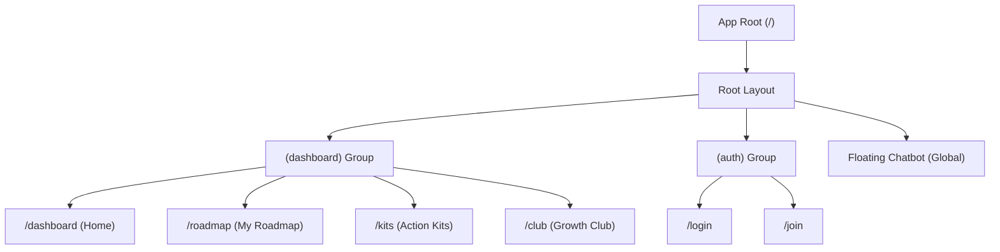

# StepZero Information Architecture (IA) - 개발자 가이드

> **👨‍💻 주니어 개발자를 위한 노트**
> 이 문서는 기획 관점의 IA를 **개발자가 구현해야 할 구조**로 재해석한 문서입니다.
> - **용어 설명**: 기획 용어가 실제 코드(Component, Page)와 어떻게 매핑되는지 설명합니다.
> - **구현 포인트**: 각 섹션마다 개발 시 유의해야 할 기술적 포인트(State, API, Layout)를 포함했습니다.

---

## 1. 프로젝트 개요 (Overview)

StepZero는 **"예비 창업자를 위한 실행형 로드맵 서비스"**입니다.
가장 중요한 핵심은 사용자의 상태(Data)에 따라 대시보드가 **두 가지 모드**로 완전히 바뀐다는 점입니다.

1.  **로드맵이 없을 때 (Cold Start)**: "뭐부터 해야 하지?" -> 입력을 유도하는 **입력 폼(Hero Input)** 중심.
2.  **로드맵이 있을 때 (Active)**: "오늘 할 일은?" -> **진행 상황(Progress)**과 **할 일(Todo)** 중심.

---

## 2. 전체 사이트 구조 (Sitemap)

이 구조는 `Next.js App Router`의 폴더 구조와 직결됩니다.



### 🔍 개발 포인트
- **Route Groups**: `(dashboard)`와 `(auth)`로 그룹을 나누어 레이아웃(`layout.tsx`)을 분리해야 합니다.
- **Global Layout**: 챗봇(Chatbot)은 어떤 페이지에 있든 항상 떠 있어야 하므로 `Root Layout`에 포함되어야 합니다.

---

## 3. 상세 페이지 구조 (Page Setup)

### 3.1. 대시보드 (Home) - `/dashboard`
가장 복잡한 페이지입니다. `useDashboard` 훅에서 데이터를 받아와 조건부 렌더링을 합니다.

#### 🅰️ Mode A: 초기 진입 (Cold Start)
- **대상**: `roadmap === null` 인 사용자.
- **핵심 컴포넌트**: `<HeroSection />`
- **기능**:
    - 업종 입력 받기 (`<input>`) -> API 호출 (`POST /api/roadmap/init`) -> 로딩 애니메이션 -> 모드 B로 전환.
- **구현 팁**: 사용자가 엔터를 치자마자 로딩 UI를 보여주어 "뭔가 처리되고 있다"는 느낌을 줘야 이탈하지 않습니다.

#### 🅱️ Mode B: 활성 대시보드 (Active)
- **대상**: `roadmap !== null` 인 사용자.
- **핵심 컴포넌트**:
    - `<ProgressCard />`: 원형 진행률 그래프 (Recharts 또는 SVG 활용).
    - `<RoadmapStepper />`: 가로로 스크롤되는 로드맵 단계 리스트. (현재 단계는 Pulse 애니메이션).
    - `<ActionRecommend />`: 현재 단계에 딱 맞는 서류 다운로드 버튼.

---

### 3.2. 나의 로드맵 (Roadmap) - `/roadmap`
- **UI 스타일**: 수직 타임라인 (Vertical Timeline).
- **데이터 구조**: `Node` (각 단계)들의 리스트.
    - `status`: `'locked'`(잠김) | `'active'`(현재) | `'completed'`(완료).
- **인터랙션**:
    - 노드 클릭 시 -> **상세 패널(Drawer/Modal)**이 열려야 합니다. 페이지 이동이 아닙니다! (UX 끊김 방지)
    - 상세 패널 안에서 [완료 체크]를 하면 즉시 대시보드의 진행률도 올라가야 합니다 (React Query의 `invalidateQueries` 활용).

---

### 3.3. 액션 킷 (Action Kits) - `/kits`
- **기능**: 자료실 게시판과 비슷합니다.
- **필터링**: 사용자가 '카페' 업종이라면, 카페 관련 서류만 먼저 보여줘야 합니다 (Client Side Filtering 또는 API Query Param).
- **다운로드**: 파일 클릭 시 바로 다운로드되거나 미리보기 모달을 띄웁니다.

---

### 3.4. 성장 클럽 (Growth Club) - `/club`
- **UI 스타일**: 인스타그램 피드 형태.
- **핵심 기능**: '인증샷' 올리기.
- **구현 포인트**:
    - 무한 스크롤 (Infinite Scroll) 적용 필요.
    - 이미지 업로드 시 미리보기 및 리사이징 처리.

---

## 4. 반응형 전략 (Mobile vs PC)

주니어 개발자가 가장 놓치기 쉬운 부분입니다. 모바일과 PC의 **네비게이션(메뉴)**이 다릅니다.

### 📱 Mobile (화면 너비 < 768px)
- **하단 탭바 (Bottom Tab Bar)**: 엄지손가락으로 누르기 쉽게 하단에 고정합니다.
- **햄버거 메뉴 없음**: 핵심 메뉴 4~5개를 탭바에 모두 노출합니다.
- **챗봇**: 화면을 가리지 않게 조심해야 합니다. (탭바 위에 띄움)

### 🖥️ Desktop (화면 너비 >= 768px)
- **왼쪽 사이드바 (Sidebar)**: 넓은 화면을 활용해 왼쪽에 메뉴를 둡니다.
- **레이아웃**:
    - 모바일: 컴포넌트들이 위에서 아래로 쌓임 (`flex-col`).
    - PC: 컴포넌트들이 격자 형태로 배치됨 (`grid`).

> **💡 Tip**: Tailwind CSS의 `hidden md:block` (모바일 숨김, PC 보임) 또는 `md:hidden` (모바일 보임, PC 숨김) 클래스를 적극 활용하세요.

---

## 5. 주요 데이터 모델 (Types)

개발 전 미리 알아두면 좋은 핵심 데이터 타입입니다. (`src/types/index.ts` 참고)

```typescript
// 사용자 상태
interface User {
  id: string;
  name: string;
  businessType?: string; // 예: "restaurant", "cafe" (없으면 Cold Start 모드)
}

// 로드맵 단계
interface RoadmapStep {
  id: string;
  title: string;       // 예: "보건증 발급"
  status: 'locked' | 'active' | 'completed';
  requiredDocs: string[]; // 필요한 액션 킷 ID 목록
}
```
