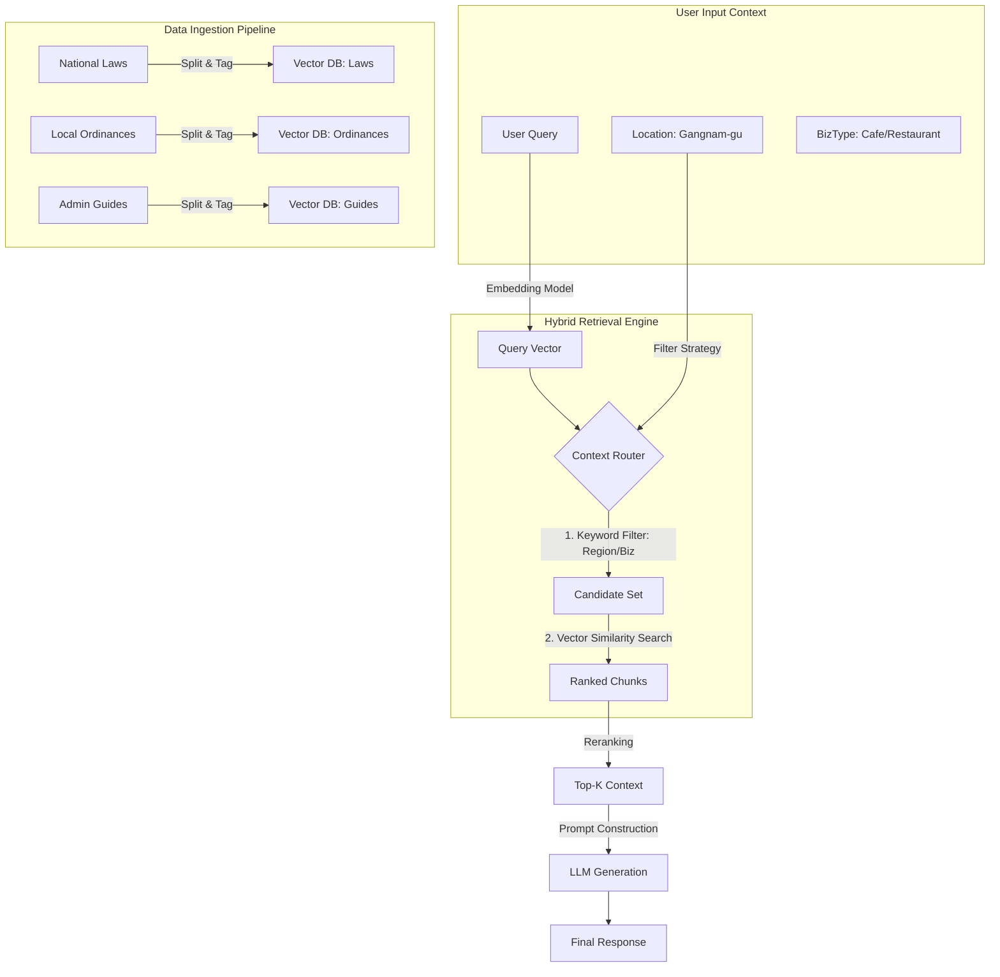

# StepZero Legal RAG Architecture: Hybrid Hierarchical System

## 1. Overview
StepZero의 'Legal Chatbot'은 일반적인 RAG와 달리, **사용자의 지역(Location)과 업종(BizType)**에 따라 적용되는 법령이 달라지는 특성을 반영해야 합니다. 이를 위해 **Hybrid Hierarchical RAG (계층형 하이브리드 검색)** 아키텍처를 채택합니다.

## 2. Core Concepts
*   **Hierarchical (계층형):** 상위법(국가법령)과 하위법(자치법규)의 위계 관계를 데이터 구조에 반영.
*   **Hybrid Search (하이브리드):** 의미 기반의 Vector Search와 정확한 필터링을 위한 Keyword Search(Metadata Filter) 결합.
*   **Hyper-Local (초지역성):** 사용자 위치 기반으로 조례/규칙을 정밀 타격하여 할루시네이션 최소화.

## 3. Architecture Diagram

## 4. Key Components Strategy

### 4.1. Context Analysis & Refinement Layer (Option A)
가장 먼저 사용자의 의도를 파악하고, 불완전한 질문을 보완합니다.

*   **Context Extraction:** 자연어 질문에서 `Region`(지역), `BizType`(업종), `Scale`(규모) 추출.
*   **Interactive Refinement (Option A):** 필수 정보 누락 시 되묻기 모듈 발동.
    *   **Trigger:** "카페 창업" (업종 모호) -> `BizType` 불명확 감지.
    *   **Action:** "휴게음식점(커피만)인가요, 일반음식점(주류포함)인가요?" 질문 생성.
*   **Metadata Tagging:** 확정된 정보를 바탕으로 검색 필터용 태그(`region_code`, `biz_category`) 생성.

### 4.2. Metadata Taxonomy (메타데이터 분류 체계)
데이터를 청킹(Chunking)할 때, 단순 텍스트 외에 강력한 필터 태그를 부착합니다.

| 필드명         | 설명      | 예시 값                                           | 비고              |
| :------------- | :-------- | :------------------------------------------------ | :---------------- |
| `doc_type`     | 문서 유형 | `law`(법령), `ordinance`(조례), `guide`(가이드)   | 대분류            |
| `region_code`  | 지역 코드 | `1168000000`(강남구), `0000000000`(전국)          | 행정표준코드 사용 |
| `biz_category` | 적용 업종 | `food_sanitation`(식품위생), `architecture`(건축) | 다중 태그 가능    |
| `law_id`       | 법령 ID   | `001234`                                          | 상위법 연결용     |

### 4.2. Retrieval Strategy (검색 전략)
1.  **Level 1 (Filtering):** 사용자의 `region_code`와 일치하는 조례 + `region_code=All`(상위법) 데이터만 1차 필터링. (검색 대상 90% 축소)
2.  **Level 2 (Vector Search):** 필터링된 데이터 안에서 사용자의 질문(`Query Vector`)과 의미적으로 유사한 조항 검색.
3.  **Level 3 (Reranking):** 검색된 조항 중 '벌칙', '의무' 등 핵심 키워드가 포함된 문서를 우선순위 조정.

### 4.3. Roadmap Generation Layer (로드맵 생성기 - AI Biz-Navigator 엔진)
RAG가 **"재료(법적 근거)"**를 찾아준다면, 로드맵 생성기는 이를 **"요리(순서 배열)"**하는 역할을 합니다.

*   **Workflow:**
    1.  **Template Retrieval:** 업종별 표준 절차 템플릿 로드 (예: 일반음식점 표준 절차).
    2.  **Context Injection:** RAG를 통해 해당 지역/업종의 특수 규제(예: "강남구 옥외광고물 허가 필수") 검색.
    3.  **LLM Sequencing:** 표준 템플릿에 특수 규제를 끼워넣어 **사용자 맞춤형 순서도(Directed Acyclic Graph)** 생성.
    4.  **Output:** `Step 1: 보건증 발급` -> `Step 2: 위생교육` -> `Step 3: 영업신고`

### 4.4. Action Kit Integration (실행 도구 연동)
로드맵의 각 단계(Node)에 사용자가 즉시 실행할 수 있는 **구체적인 도구(Action Kit)**를 매핑합니다.

*   **Structure:**
    *   **Checklist:** 해당 단계에서 놓치면 안 되는 필수 항목 (예: "위생교육 수료증 원본 지참").
    *   **Documents (Forms):** 법령/조례에 명시된 필수 서식(HWP/PDF) 자동 다운로드 링크 제공.
    *   **Guide:** 서류 작성법, 관공서 방문 시 팁, 수수료 정보 등 실무 가이드.
    *   법제처 '법령 별지 서식' 데이터 (Form File).
    *   행정안전부 '민원 처리에 관한 법률' 및 각 지자체 행정 서비스 헌장 (Guide).

### 4.5. Safety Guardrails (안전 장치)
법적 리스크를 최소화하고 정보의 투명성을 보장합니다.

*   **Citations:** 모든 답변에 근거 법령/조례의 **원문 링크(Link)**를 강제 첨부.
*   **Disclaimer:** "본 답변은 법적 효력이 없으며, 최종 확인은 관공서에 필요함" 문구 자동 삽입.
*   **Risk Filter:** '불법 증축', '세금 포탈' 등 위험 키워드 감지 시 답변 거부 및 전문가 연결.

## 5. Next Steps
1.  **법제처 API 명세 분석:** 실제 `region_code`와 `law_id`를 어떻게 가져올지 확인.
2.  **Database Design:** Vector DB(예: Pinecone, Weaviate 등)와 관계형 DB(메타데이터용)의 스키마 설계.
