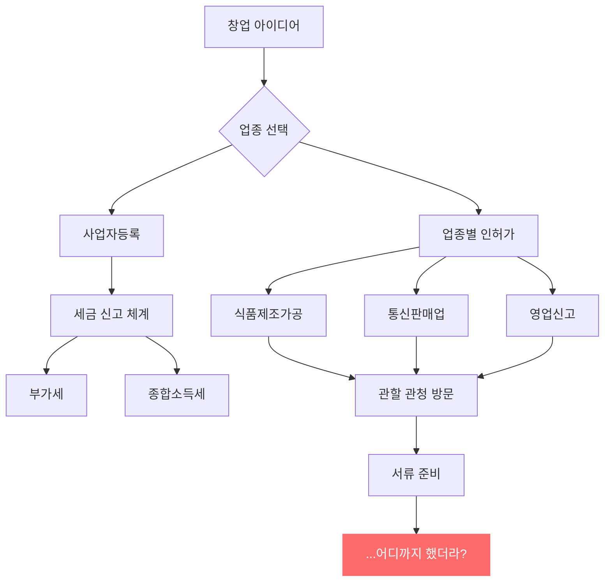
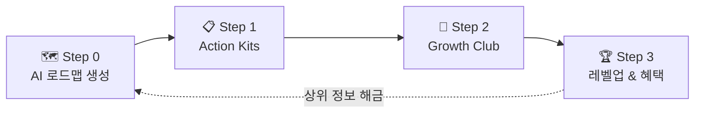
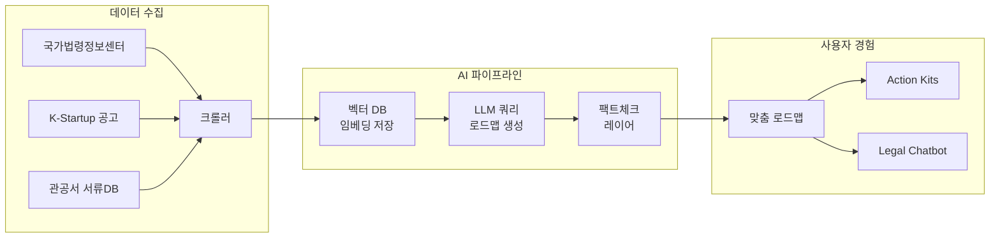
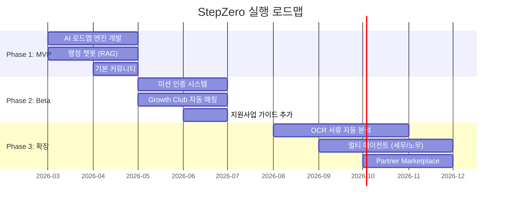

# StepZero Slidev 슬라이드 작성 계획서 (v2)

> 대상: 창업 경진대회 | 분량: 10~15분 / 18장 | 도구: Slidev
> 시장 데이터 반영 완료

---

## 1. Headmatter (전체 설정)

```yaml
---
theme: apple-basic
title: StepZero - AI 기반 창업 네비게이터
author: 종만
colorSchema: light
aspectRatio: 16/9
canvasWidth: 980
transition: slide-left
fonts:
  sans: Pretendard
  mono: Fira Code
  provider: none
defaults:
  transition: slide-left
---
```

---

## 2. 슬라이드별 상세 작성 계획

---

### Slide 1 — 표지

```
layout: cover
```

**내용:**
- 제목: **StepZero**
- 부제: AI 기반 창업 네비게이터 & 성장 플랫폼
- 슬로건: *"Step 1 이전의 모든 막막함을 해결합니다"*
- 발표자 이름, 날짜

**연출:** 없음 (깔끔한 첫인상)

---

### Slide 2 — Hook: 실제 질문들

```
layout: quote
```

**내용 (v-click 순차 등장):**

1. "사업자등록은 어디서 하는 거예요?"
2. "통신판매업 신고가 먼저인가요, 사업자등록이 먼저인가요?"
3. "인터넷에 다 다르게 나와있는데 뭘 믿어야 하죠?"

→ 마지막 v-click: **"매년 118만 명이 이 질문을 합니다."**

**연출:**
- `v-click`으로 질문 하나씩 등장
- 마지막 숫자에 `v-mark.underline.red` 적용
- 발표자 노트: "이 질문들, 다 실제로 네이버 지식인과 창업 카페에서 매일 올라오는 질문들입니다."

---

### Slide 3 — 문제 정의: 죽음의 계곡

```
layout: default
```

**내용 (v-clicks 순차 공개):**

**"창업 5년 후, 10곳 중 7곳은 문을 닫습니다"**

- 🔍 **정보의 홍수**: 검색 결과 100개, 정답 0개. "카더라" 정보가 판을 친다
- 🛡️ **신뢰의 부재**: 블로그마다 다른 말, 법령 원문은 읽기 어렵다
- 😰 **실행의 고립**: 혼자서 모든 결정을 내려야 하는 막막함

→ 하단 데이터 박스:
*"1년 생존율 78% → 5년 생존율 29.2%. 준비 부족이 급격한 붕괴를 만듭니다."*

**연출:**
- 제목 "10곳 중 7곳"에 `v-mark.circle.red` 강조
- 3개 Pain Point는 `<v-clicks>`로 순차 등장
- 하단 데이터는 마지막 v-click으로 등장

**발표자 노트:**
"국내 창업기업 5년 생존율은 29.2~34.7%입니다. 1년 차에는 78%가 살아남지만, 3~5년 차에 급격히 무너집니다. 왜? 준비가 부족한 채로 시작하기 때문입니다."

---

### Slide 4 — 문제 시각화: 창업 절차의 미로

```
layout: center
```

**내용 (Mermaid Flowchart):**



하단 카피: **"이걸 혼자 알아내야 합니다. 그것도 처음으로."**

**연출:**
- 다이어그램이 중앙에 크게 표시
- 마지막 노드(빨간색) "어디까지 했더라?"가 포인트

**발표자 노트:**
"실제로 카페 창업 하나 하려면 이 정도 절차를 거쳐야 합니다. 경험 없는 예비 창업자에게는 미로와 같죠."

---

### Slide 5 — 솔루션 선언

```
layout: statement
```

**내용:**

> **StepZero**는 복잡한 창업 절차를
> 당신만의 **내비게이션**으로 바꿔드립니다.

**연출:**
- `v-mark.circle.blue`로 "내비게이션" 강조
- `transition: fade` (이전 슬라이드와의 전환을 부드럽게)

**발표자 노트:**
"네이버 지도가 길을 알려주듯, StepZero는 창업의 길을 알려줍니다. AI가 '지금 당장 해야 할 일'을 순서대로 정리해줍니다."

---

### Slide 6 — 서비스 구조: The Growth Loop

```
layout: default
```

**내용 (Mermaid 순환 다이어그램 + v-click 설명):**



각 Step 아래에 v-click 한 줄 설명:
1. **Step 0**: 창업 주제만 입력하면 맞춤형 절차가 로드맵으로 자동 생성
2. **Step 1**: 각 절차 노드 클릭 → 체크리스트, 서류 양식, 작성 가이드 제공
3. **Step 2**: 같은 단계 창업자들과 자동 매칭, 미션 인증으로 함께 완주
4. **Step 3**: 달성률에 따라 레벨업, 투자 유치/마케팅 정보 및 제휴 혜택

**연출:**
- Mermaid 다이어그램은 처음부터 표시
- 아래 설명 텍스트가 `v-click`으로 Step별 순차 등장

**발표자 노트:**
"StepZero의 핵심 구조입니다. 단순히 정보를 던져주는 게 아니라, 로드맵 생성 → 실행 도구 → 커뮤니티 → 보상까지 하나의 선순환 루프를 만듭니다."

---

### Slide 7 — 핵심 기능 ①: AI Biz-Navigator

```
layout: two-cols
```

**좌측 (::default::):**

**AI Biz-Navigator** — 핵심 엔진

<v-clicks>

- "반려동물 수제 간식" 입력 → 맞춤 로드맵 즉시 생성
- **LLM + RAG** 기반: 법령/공고문 원문에서 답을 찾음
- "카더라" 정보 Zero → 출처가 명확한 가이드

</v-clicks>

**우측 (::right::):**

- [UI 목업 이미지 영역]
- 또는 간단한 Mermaid로 입력→출력 플로우 시각화

**발표자 노트:**
"핵심 엔진입니다. 사용자가 창업 아이템만 입력하면, AI가 법인 설립부터 영업신고까지의 전체 절차를 나만의 로드맵으로 자동 생성합니다. 중요한 건 RAG 기술로 법령 원문에 기반한다는 점입니다."

---

### Slide 8 — 핵심 기능 ②: Action Kits + Legal Chatbot

```
layout: two-cols
```

**좌측 (::default::):**

**Action Kits** — 바로 실행 가능한 도구

- ✅ 사업자등록 체크리스트
- 📄 관공서 서류 양식 (HWP/PDF)
- 📝 서류 작성 가이드

**우측 (::right::):**

**Legal Chatbot** — 법령 기반 Q&A

> Q: "통신판매업 신고는 어디서 하나요?"
> A: "「전자상거래법」 제12조에 따라 관할 시·군·구청에 신고합니다. 준비물은..."

- 출처 원문 링크 제공
- 할루시네이션 방지 (RAG 팩트체크 레이어)

**연출:** 좌우 각각 `v-click`으로 등장

**발표자 노트:**
"로드맵의 각 노드를 클릭하면 바로 쓸 수 있는 도구가 나옵니다. 체크리스트, 서류 양식, 작성 가이드. 그리고 궁금한 점은 법령 기반 챗봇이 즉시 답변합니다."

---

### Slide 9 — 핵심 기능 ③: Growth Club

```
layout: default
```

**내용:**

**Growth Club** — 혼자가 아닌, 함께 완주

<v-clicks>

- 🎯 **자동 매칭**: 같은 업종, 같은 단계의 창업자끼리 그룹핑 (기수제)
- 📸 **미션 인증**: 절차 완료 인증샷 → 동료 피드백 → 미션 클리어
- 🏅 **성장 인증서**: 챌린지 완주 시 공식 인증서 발급

</v-clicks>

*"AI가 해결할 수 없는 정서적 지지와 실전 팁은 커뮤니티가 보완합니다."*

**발표자 노트:**
"AI만으로는 부족합니다. 혼자 하면 포기하기 쉬운 과정을, 같은 단계의 동료들과 미션을 수행하며 함께 완주합니다. 이것이 StepZero의 리텐션 핵심입니다."

---

### Slide 10 — 데모 시나리오

```
layout: default
clicks: 4
```

**제목: "반려동물 수제 간식 창업" 따라가기**

<v-switch>

**#1 — Step 0: 로드맵 생성**
"반려동물 간식" 입력 → AI가 분석 → 맞춤 로드맵 생성
`식품제조가공업 허가 → 영업신고 → 사업자등록 → 통신판매업 신고 → 세금 체계 설정`

**#2 — Step 1: Action Kit 실행**
"식품제조가공업 허가" 클릭 →
✅ 준비물: 영업장 도면, 위생교육 수료증, 건강진단서
📍 관할: OO구청 위생과

**#3 — Step 2: Growth Club 참여**
같은 단계 창업자 5명과 자동 매칭
→ "저도 위생교육 다녀왔어요!" 인증샷 공유

**#4 — Step 3: 레벨업**
미션 완료 → 레벨 2 달성 → 다음 단계 "영업신고" 해금
→ 제휴 혜택: 포장재 업체 10% 할인

</v-switch>

**연출:**
- `v-switch`로 4단계를 클릭마다 전환
- 각 단계마다 화면이 완전히 바뀌는 효과
- 이 슬라이드가 **발표의 하이라이트**

**발표자 노트:**
"실제 시나리오로 보여드리겠습니다. (클릭하며) 반려동물 간식으로 창업하고 싶다고 입력하면... AI가 이렇게 맞춤 로드맵을 만들어줍니다. (클릭) 첫 번째 절차를 클릭하면 바로 실행 가능한 체크리스트가 나옵니다. (클릭) 같은 단계의 동료들과 함께 미션을 수행하고... (클릭) 완료하면 레벨업과 함께 다음 단계로 넘어갑니다."

---

### Slide 11 — 기술 아키텍처

```
layout: default
```

**내용 (Mermaid):**



하단 핵심 포인트:
- **데이터 출처**: 국가법령정보센터, K-Startup, 관공서 서류 DB
- **신뢰성 장치**: RAG + 팩트체크 레이어 (출처 원문 링크 제공)
- **면책**: 법률 자문이 아닌 "정보 가이드" 포지셔닝

**연출:** 서브그래프 3개가 좌→우로 자연스럽게 읽힘

**발표자 노트:**
"기술 구조입니다. 국가법령정보센터와 K-Startup 공고를 수집하여 벡터 DB에 저장하고, LLM이 이를 기반으로 로드맵을 생성합니다. 핵심은 팩트체크 레이어입니다. AI가 만든 답변을 원문과 대조하여 정확성을 보장합니다."

---

### Slide 12 — 시장 기회: TAM / SAM / SOM

```
layout: fact
```

**내용 (v-click 퍼널):**

<div v-click>

## 118만 명/년
**TAM** — 연간 신규 창업자 수
<small>중소벤처기업부 2024년 창업기업동향. 경기 침체에도 생계형 창업 8.0% 증가</small>

</div>

<div v-click>

## 65만 명
**SAM** — 생계형·소자본 '나홀로 사장님'
<small>개인서비스, 도소매, 숙박음식업 등 소상공인 비중 55~60%</small>

</div>

<div v-click>

## 2만 명 → 월 2억 원
**SOM** — 1.5년 내 점유 3% 목표
<small>2만 명 × 월 9,900원 Pro 멤버십</small>

</div>

**연출:**
- `layout: fact`로 큰 숫자 강조
- 3단계 퍼널이 v-click으로 순차 등장
- 마지막 "월 2억 원"에 `v-mark.underline.blue`

**발표자 노트:**
"118만 명이라는 거대한 파도가 매년 밀려옵니다. 이 중 고가 컨설팅을 받기 어렵고 직접 발로 뛰어야 하는 65만 명이 우리의 1차 타겟입니다. 그 중 3%인 2만 명만 확보해도 월 매출 2억 원이 발생합니다."

---

### Slide 13 — 경쟁 분석: 포지셔닝 맵

```
layout: center
```

**내용:**

**2x2 포지셔닝 맵**

| | Community Low | Community High |
|---|---|---|
| **Trust/Automation High** | ChatGPT, Claude<br/><small>즉각 답변, 한국행정 모름, 고립감</small> | **✦ StepZero**<br/><small>RAG 신뢰성 + 함께 실행</small> |
| **Trust/Automation Low** | K-Startup, 정부포털<br/><small>신뢰 100%, UI/UX 불편</small> | 네이버 카페/블로그<br/><small>"카더라" 정보, 광고 홍수</small> |

→ StepZero는 **"신뢰할 수 있는 AI + 함께하는 커뮤니티"**를 동시에 가진 유일한 솔루션

**연출:**
- 표 형태로 4사분면 구성
- StepZero 위치에 `v-mark.circle.blue` 강조
- 다른 경쟁사는 먼저 표시되고, StepZero는 마지막 v-click으로 등장

**발표자 노트:**
"기존 솔루션들을 두 가지 축으로 나눠봤습니다. ChatGPT는 빠르지만 한국 행정을 모르고, 네이버 카페는 커뮤니티는 있지만 정보가 부정확합니다. 정부 포털은 정확하지만 불편합니다. StepZero만이 두 가지를 동시에 만족시킵니다."

---

### Slide 14 — 수익 모델

```
layout: two-cols
```

**좌측 (::default::) — 수익원 3가지:**

<v-clicks>

**① Pro 멤버십 (메인 수익)**
월 9,900원 — *커피 2잔 값으로 '창업 비서' 고용*
심화 로드맵 + 전문가 AI 챗봇 + 지원사업 알림

**② 전문가 매칭 수수료 (확장)**
건당 10~20% — AI 초안 기반 효율적 상담
세무사/노무사 Win-Win 구조

**③ 지원사업 매칭 (Phase 3)**
업종/연차 맞춤 정부 지원사업 연결 수수료

</v-clicks>

**우측 (::right::) — 경쟁 가격 비교:**

| 서비스 | 가격 | StepZero |
|--------|------|----------|
| 자비스 (세무) | 월 3.3만원~ | 기본 무료 |
| 캐시노트 (매장) | 월 1.65만원~ | Pro 월 9,900원 |
| 숨고 (컨설팅) | 건당 ~98만원 | 건당 5~10만원 |
| 로톡 (법률) | 15분 2~3만원 | AI 챗봇 무제한 |

**연출:**
- 좌측 수익원은 v-clicks로 순차 등장
- 우측 가격 비교표로 앵커링 효과

**발표자 노트:**
"수익 모델의 핵심은 Pro 멤버십 월 9,900원입니다. 커피 2잔 값으로 창업 비서를 고용하는 셈이죠. 경쟁사 대비 가격을 보시면... 자비스 3.3만 원, 숨고 컨설팅 98만 원 대비 압도적으로 합리적인 가격입니다."

---

### Slide 15 — 실행 로드맵 + KPI

```
layout: default
```

**내용 (Mermaid Gantt):**



**Phase별 KPI 목표 (v-clicks):**

| Phase | 기간 | 핵심 KPI |
|-------|------|----------|
| **P1: MVP** | 1~2개월 | MAU 1,000 / 로드맵 생성 5,000건 |
| **P2: Beta** | 3~4개월 | MAU 5,000 / 완주율 30% / Growth Club 50개 |
| **P3: 확장** | 5개월~ | MAU 20,000 / 월 매출 2억 원 |

**연출:**
- Gantt 차트가 먼저 표시
- 하단 KPI 테이블이 v-clicks로 Phase별 등장

**발표자 노트:**
"3단계 로드맵입니다. 1~2개월 내 MVP를 출시하여 MAU 1,000명을 확보하고, 4개월차에 미션 시스템과 커뮤니티를 도입합니다. 5개월차부터 OCR, 멀티 에이전트 등으로 확장하며, 월 매출 2억 원을 목표로 합니다."

---

### Slide 16 — 팀 소개

```
layout: default
```

**내용:**

**우리 팀**

<v-clicks>

- **[이름]** — CEO / 기획 총괄
  _[핵심 역량/경험]_

- **[이름]** — CTO / AI 엔진 개발
  _[핵심 역량/경험]_

- **[이름]** — CPO / 프로덕트 디자인
  _[핵심 역량/경험]_

</v-clicks>

> ⚠️ **종만님 Action**: 팀원 정보를 채워주세요

**발표자 노트:**
"저희 팀은 [역량 요약]을 보유하고 있어, 이 서비스를 만들어낼 수 있는 팀입니다."

---

### Slide 17 — 비전

```
layout: statement
transition: fade
```

**내용:**

> **StepZero의 목표는
> 창업 5년 생존율을
> <span v-mark.circle.red>10%p</span> 올리는 것입니다.**

*"모든 예비 창업자의 출발선을 평등하게"*

**연출:**
- `transition: fade`로 부드럽게 전환
- "10%p"에 `v-mark.circle.red` 적용
- 감정적 여운을 남기는 슬라이드

**발표자 노트:**
"현재 29%인 5년 생존율을 39%로 올리는 것. 10곳 중 3곳이 살아남는 세상에서, 4곳이 살아남게 만드는 것. 그것이 StepZero의 목표입니다."

---

### Slide 18 — 클로징 & Q&A

```
layout: end
```

**내용:**

**감사합니다**

StepZero — Step 1 이전의 모든 막막함을 해결합니다.

📧 lastdays03@gmail.com
🌐 [웹사이트 URL]

**Q&A**

---

## 3. 데이터 출처 정리

| 슬라이드 | 사용 데이터 | 출처 |
|----------|------------|------|
| #2 Hook | 118만 명 신규 창업자 | 중소벤처기업부 2024년 창업기업동향 |
| #3 문제 | 5년 생존율 29.2~34.7% | 중소벤처기업부 창업기업동향 |
| #3 문제 | 1년 생존율 78% | 동일 출처 |
| #12 TAM | 118만 명/년 | 중소벤처기업부 2024년 창업기업동향 |
| #12 SAM | 65만 명 (55~60%) | 소상공인 비중 추산 |
| #12 SOM | 2만 명, 월 2억 원 | 자체 목표치 (9,900원 × 2만) |
| #14 수익 | 자비스 3.3만원, 캐시노트 1.65만원 | 각 서비스 공시 가격 |
| #14 수익 | 숨고 컨설팅 ~98만원 | 숨고 평균 견적가 |
| #14 수익 | 로톡 15분 2~3만원 | 로톡 공시 가격 |

---

## 4. 종만님 Action Items (슬라이드 제작 전 필요)

| 우선순위 | 항목 | 해당 슬라이드 | 상태 |
|---------|------|-------------|------|
| 🔴 필수 | 팀원 정보 (이름, 역할, 역량) | #16 | 미완 |
| 🔴 필수 | UI 목업 또는 와이어프레임 | #7, #8, #9 | 미완 |
| 🟡 권장 | MVP 스크린샷 (있다면) | #10 | 미완 |
| 🟡 권장 | 로고 이미지 파일 | #1 | 미완 |
| 🟢 선택 | 웹사이트/랜딩페이지 URL | #18 | 미완 |

---

## 5. 발표 타이밍 가이드 (총 12분)

| 구간 | 슬라이드 | 시간 | 누적 |
|------|---------|------|------|
| 오프닝 + Hook | #1~2 | 0:45 | 0:45 |
| 문제 정의 | #3~4 | 1:45 | 2:30 |
| 솔루션 | #5~6 | 2:00 | 4:30 |
| 핵심 기능 | #7~9 | 2:30 | 7:00 |
| 데모 시나리오 | #10 | 1:30 | 8:30 |
| 기술 | #11 | 0:45 | 9:15 |
| 시장 + 경쟁 | #12~13 | 1:15 | 10:30 |
| 수익 + 로드맵 | #14~15 | 1:15 | 11:45 |
| 팀 + 비전 + Q&A | #16~18 | 0:45 | **12:30** |
