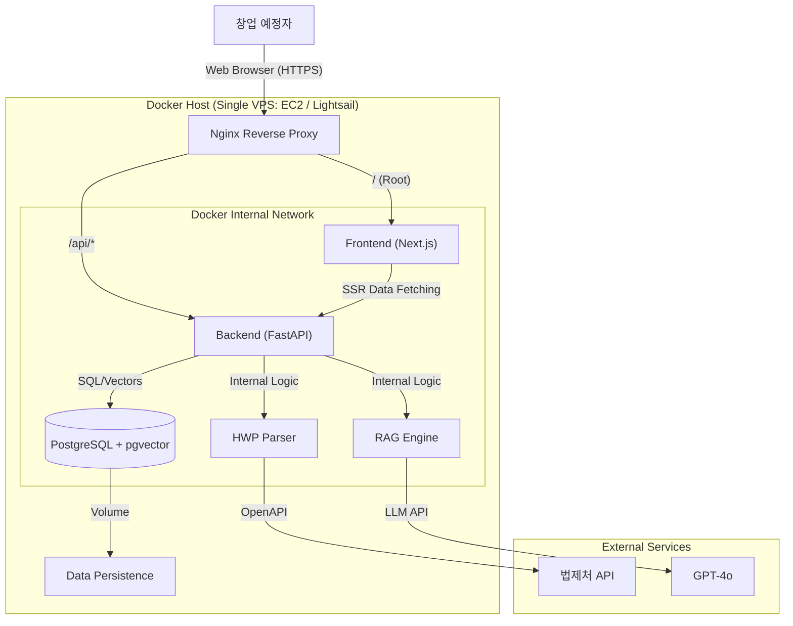

# StepZero Technical Architecture (Option A - All-in-One Docker)

## 1. Overview
StepZero는 **개발 속도와 운영 단순화**를 최우선으로 하여, 모든 서비스(Frontend, Backend, DB)를 **단일 서버(VPS) 내 Docker Compose**로 통합 배포하는 **Monolithic Deployment** 아키텍처를 채택합니다.

이 구조는 초기 비용을 최소화하고, 내부 네트워크를 통한 고성능 데이터 처리를 보장하며, 향후 트래픽 증가 시 각 컴포넌트를 분리하기 쉬운 구조입니다.

---

## 2. System Architecture Diagram

---

## 3. Technology Stack & Docker Configuration

### 3.1. Frontend Service (`app-frontend`)
*   **Tech:** Next.js 14 (App Router)
*   **Mode:** Standalone Output (`output: 'standalone'`) - Docker 이미지 경량화
*   **Role:** UI 렌더링, 사용자 상호작용
*   **Port:** Internal 3000

### 3.2. Backend Service (`app-backend`)
*   **Tech:** FastAPI (Python 3.11)
*   **Role:** REST API, RAG 로직, HWP 파싱
*   **Port:** Internal 8000
*   **Workers:** Uvicorn with Gunicorn (Production)

### 3.3. Database Service (`app-db`)
*   **Tech:** PostgreSQL 16 + `pgvector`
*   **Image:** `ankane/pgvector:latest`
*   **Role:** 정형 데이터(회원, 로드맵) 및 비정형 데이터(법령 벡터) 저장
*   **Port:** Internal 5432 (외부 노출 X)

### 3.4. Reverse Proxy (`app-proxy`)
*   **Tech:** Nginx
*   **Role:** SSL Termination (LetsEncrypt), 경로 라우팅, 정적 파일 캐싱
*   **Config:**
    *   `location /` -> `http://app-frontend:3000`
    *   `location /api` -> `http://app-backend:8000`

---

## 4. Key Workflows

### 4.1. Local Development vs Production
*   **Local:** `docker-compose.dev.yml` 사용. 소스 코드 변경 시 Hot Reloading (Volume Mount).
*   **Production:** `docker-compose.prod.yml` 사용. 최적화된 Docker Image 빌드 및 배포.

### 4.2. Deployment Process (Simple CI/CD)
1.  **Code Push:** GitHub `main` 브랜치에 푸시.
2.  **GitHub Actions:**
    *   SSH로 VPS 접속.
    *   `git pull`
    *   `docker-compose up -d --build`
    *   오래된 이미지 정리 (`docker image prune`).

---

## 5. Pros & Cons (vs Separate Services)
*   **Pros:**
    *   **비용 효율:** 월 $5~10 수준의 VPS 하나로 모든 서비스 운영 가능.
    *   **성능:** 프론트엔드와 백엔드가 같은 머신(Docker Network)에 있어 통신 지연이 거의 없음 (0ms 수준).
    *   **관리 용이:** `docker-compose` 파일 하나로 인프라 전체 형상 관리.
*   **Cons:**
    *   **SPOF:** 서버 하나가 죽으면 서비스 전체 중단. (하지만 초기 단계에선 허용 가능)
    *   **리소스 공유:** RAG 작업이 CPU를 점유하면 프론트엔드 반응이 느려질 수 있음. (CPU 제한 설정으로 완화 가능)
