# StepZero ERD (Entity Relationship Diagram)

> 자동 생성일: 2026-03-13 | 소스: `app-backend/app/models/`

## 전체 ERD

```mermaid
erDiagram
    %% ═══════════════════════════════════════════
    %% 1. Auth & User 도메인
    %% ═══════════════════════════════════════════

    User {
        int id PK
        string email UK
        string hashed_password
        string full_name
        bool is_active
        bool is_superuser
        bool is_suspended
        string status
        int report_count
        datetime suspended_at
        string suspension_reason
        datetime suspended_until
        string audit_log_reason
        datetime last_login_at
        datetime created_at
        datetime updated_at
    }

    UserProfile {
        int id PK
        int user_id FK,UK
        string nickname
        string profile_img
        bool is_public
        string category
        string region
        string philosophy
        json experiences
        json awards
        json certificates
        datetime updated_at
    }

    RefreshToken {
        uuid id PK
        int user_id FK
        string token_hash
        datetime expires_at
        bool revoked
        uuid replaced_by
        datetime created_at
    }

    UserDisciplineHistory {
        int id PK
        int user_id FK
        int admin_id FK
        string prev_status
        string new_status
        string reason
        datetime suspended_until
        datetime created_at
    }

    %% ═══════════════════════════════════════════
    %% 2. Team 도메인
    %% ═══════════════════════════════════════════

    Team {
        uuid id PK
        string name
        int created_by FK
        int updated_by FK
        datetime created_at
        datetime updated_at
        datetime deleted_at
    }

    TeamMember {
        int id PK
        uuid team_id FK
        int user_id FK
        string role
        datetime created_at
        datetime updated_at
    }

    %% ═══════════════════════════════════════════
    %% 3. Roadmap 도메인
    %% ═══════════════════════════════════════════

    Roadmap {
        uuid id PK
        uuid team_id FK
        int template_id FK
        string title
        string business_type
        string location
        string description
        string startup_type
        string startup_method
        string open_timeline
        string budget_range
        string additional_notes
        int goal_horizon_days
        int created_by FK
        int updated_by FK
        datetime created_at
        datetime updated_at
        datetime deleted_at
    }

    RoadmapStep {
        int id PK
        uuid roadmap_id FK
        int step_order
        string title
        string status
        datetime created_at
        datetime completed_at
    }

    RoadmapStepDetail {
        int id PK
        int roadmap_step_id FK,UK
        string phase
        string objective
        int estimated_days
        json risk_notes
        string generation_mode
        int source_count
        bool has_fallback
        string mapping_source
        datetime created_at
        datetime updated_at
    }

    RoadmapStepAction {
        int id PK
        int roadmap_step_id FK
        string action_type
        string title
        string description
        string source_url
        json metadata_json
        datetime created_at
    }

    RoadmapGenerationJob {
        uuid id PK
        uuid team_id FK
        int user_id FK
        uuid roadmap_id FK
        string status
        int progress
        string stage
        json input_payload
        string error_code
        string error_message
        datetime created_at
        datetime updated_at
        datetime started_at
        datetime completed_at
    }

    %% ═══════════════════════════════════════════
    %% 4. Roadmap Template 도메인
    %% ═══════════════════════════════════════════

    RoadmapTemplate {
        int id PK
        string business_type
        string startup_method
        string startup_type
        string title
        string status
        int version
        uuid source_roadmap_id FK
        int created_by FK
        int approved_by FK
        datetime approved_at
        datetime created_at
        datetime updated_at
    }

    RoadmapTemplateStep {
        int id PK
        int template_id FK
        int step_order
        string phase
        string title
        string objective
        int estimated_days
        json risk_notes
        datetime created_at
    }

    RoadmapTemplateAction {
        int id PK
        int template_step_id FK
        string action_type
        string title
        string description
        string source_url
        int actionkit_item_id FK
        int actionkit_file_id FK
        int sort_order
        json metadata_json
        datetime created_at
    }

    %% ═══════════════════════════════════════════
    %% 5. Roadmap Chat 도메인
    %% ═══════════════════════════════════════════

    RoadmapChatThread {
        uuid id PK
        uuid roadmap_id FK
        int step_id FK
        int user_id FK
        string title
        int message_count
        bool is_deleted
        datetime created_at
        datetime updated_at
    }

    RoadmapChatMessage {
        int id PK
        uuid thread_id FK
        string role
        text content
        json sources_json
        string intent_category
        int token_count
        datetime created_at
    }

    %% ═══════════════════════════════════════════
    %% 6. ActionKit 도메인
    %% ═══════════════════════════════════════════

    ActionKitCategory {
        int id PK
        string domain
        string slug
        string title
        int sort_order
        bool is_active
        datetime created_at
        datetime updated_at
    }

    ActionKitItem {
        int id PK
        string domain
        int category_id FK
        string name
        string summary
        string tag
        string ext
        string size_label
        string file_type
        string dday
        int sort_order
        bool is_active
        datetime created_at
        datetime updated_at
    }

    ActionKitItemHighlight {
        int id PK
        int item_id FK
        string content
        int sort_order
        datetime created_at
    }

    ActionKitChecklist {
        int id PK
        int item_id FK
        string content
        int sort_order
        datetime created_at
    }

    ActionKitRelatedLaw {
        int id PK
        int item_id FK
        string law_name
        string law_summary
        int sort_order
        datetime created_at
    }

    ActionKitEvent {
        int id PK
        string event_type
        int item_id FK
        int user_id FK
        string search_query
        datetime created_at
    }

    %% ═══════════════════════════════════════════
    %% 7. Growth Club 도메인
    %% ═══════════════════════════════════════════

    GrowthClubPost {
        int id PK
        int author_id FK
        string title
        string content
        string category
        string neighborhood
        string industry
        int report_count
        bool is_blinded
        datetime created_at
    }

    GrowthClubComment {
        int id PK
        int post_id FK
        int parent_id FK
        int author_id FK
        string content
        int report_count
        bool is_blinded
        datetime created_at
    }

    GrowthClubTag {
        int id PK
        string name UK
        datetime created_at
    }

    GrowthClubPostTagLink {
        int post_id PK,FK
        int tag_id PK,FK
    }

    GrowthClubPostLike {
        int post_id PK,FK
        int user_id PK,FK
        datetime created_at
    }

    GrowthClubPostReport {
        int id PK
        int post_id FK
        int reporter_id FK
        string reason
        datetime created_at
    }

    GrowthClubCommentReport {
        int id PK
        int comment_id FK
        int reporter_id FK
        string reason
        datetime created_at
    }

    %% ═══════════════════════════════════════════
    %% 8. File (다형성)
    %% ═══════════════════════════════════════════

    File {
        int id PK
        string owner_type
        int owner_id
        string category
        string object_key UK
        string original_filename
        string mime_type
        int size_bytes
        string checksum
        int version
        bool is_current
        string kind
        json metadata_extra
        datetime uploaded_at
        datetime created_at
    }

    %% ═══════════════════════════════════════════
    %% 9. Notification / Announcement / Audit
    %% ═══════════════════════════════════════════

    Notification {
        int id PK
        int user_id FK
        string content
        string type
        string link
        bool is_read
        bool is_deleted
        int resource_id
        datetime created_at
    }

    Announcement {
        int id PK
        string title
        string content
        string status
        int created_by FK
        int updated_by FK
        datetime published_at
        datetime created_at
        datetime updated_at
    }

    AuditLog {
        int id PK
        int user_id FK
        string action
        string target_type
        string target_id
        string target_author
        string details
        datetime created_at
    }

    AdminAuditLog {
        int id PK
        int admin_id FK
        string action
        string target_type
        string target_id
        string reason
        json meta_json
        datetime created_at
    }

    %% ═══════════════════════════════════════════
    %% 관계 (Relationships)
    %% ═══════════════════════════════════════════

    %% -- Auth & User --
    User ||--o| UserProfile : "has"
    User ||--o{ RefreshToken : "owns"
    User ||--o{ UserDisciplineHistory : "receives"
    User ||--o{ UserDisciplineHistory : "admin issues"

    %% -- Team --
    User ||--o{ Team : "creates"
    User ||--o{ TeamMember : "joins"
    Team ||--o{ TeamMember : "has"

    %% -- Roadmap --
    Team ||--o{ Roadmap : "owns"
    Roadmap ||--o{ RoadmapStep : "contains"
    RoadmapStep ||--o| RoadmapStepDetail : "has detail"
    RoadmapStep ||--o{ RoadmapStepAction : "has actions"
    RoadmapTemplate |o--o{ Roadmap : "generates"
    Team ||--o{ RoadmapGenerationJob : "requests"
    User ||--o{ RoadmapGenerationJob : "initiates"
    Roadmap |o--o{ RoadmapGenerationJob : "produced by"

    %% -- Roadmap Template --
    User ||--o{ RoadmapTemplate : "creates"
    Roadmap |o--o{ RoadmapTemplate : "source for"
    RoadmapTemplate ||--o{ RoadmapTemplateStep : "contains"
    RoadmapTemplateStep ||--o{ RoadmapTemplateAction : "has actions"
    ActionKitItem |o--o{ RoadmapTemplateAction : "linked"
    File |o--o{ RoadmapTemplateAction : "attached"

    %% -- Roadmap Chat --
    User ||--o{ RoadmapChatThread : "starts"
    Roadmap |o--o{ RoadmapChatThread : "context"
    RoadmapStep |o--o{ RoadmapChatThread : "step context"
    RoadmapChatThread ||--o{ RoadmapChatMessage : "contains"

    %% -- ActionKit --
    ActionKitCategory ||--o{ ActionKitItem : "groups"
    ActionKitItem ||--o{ ActionKitItemHighlight : "has"
    ActionKitItem ||--o{ ActionKitChecklist : "has"
    ActionKitItem ||--o{ ActionKitRelatedLaw : "references"
    ActionKitItem |o--o{ ActionKitEvent : "tracked by"
    User |o--o{ ActionKitEvent : "triggers"

    %% -- Growth Club --
    User ||--o{ GrowthClubPost : "writes"
    User ||--o{ GrowthClubComment : "writes"
    GrowthClubPost ||--o{ GrowthClubComment : "has"
    GrowthClubComment |o--o{ GrowthClubComment : "replies to"
    GrowthClubPost ||--o{ GrowthClubPostTagLink : "tagged"
    GrowthClubTag ||--o{ GrowthClubPostTagLink : "applied"
    GrowthClubPost ||--o{ GrowthClubPostLike : "liked"
    User ||--o{ GrowthClubPostLike : "likes"
    GrowthClubPost ||--o{ GrowthClubPostReport : "reported"
    User ||--o{ GrowthClubPostReport : "reports"
    GrowthClubComment ||--o{ GrowthClubCommentReport : "reported"
    User ||--o{ GrowthClubCommentReport : "reports"

    %% -- Notification / Audit --
    User ||--o{ Notification : "receives"
    User ||--o{ Announcement : "creates"
    User ||--o{ AuditLog : "logged"
    User ||--o{ AdminAuditLog : "admin action"
```

## 도메인별 테이블 요약

| 도메인 | 테이블 수 | 주요 테이블 |
|--------|-----------|-------------|
| Auth & User | 4 | `user`, `userprofile`, `refresh_tokens`, `user_discipline_history` |
| Team | 2 | `team`, `teammember` |
| Roadmap | 5 | `roadmap`, `roadmapstep`, `roadmap_step_details`, `roadmap_step_actions`, `roadmap_generation_jobs` |
| Roadmap Template | 3 | `roadmap_templates`, `roadmap_template_steps`, `roadmap_template_actions` |
| Roadmap Chat | 2 | `roadmap_chat_threads`, `roadmap_chat_messages` |
| ActionKit | 6 | `actionkit_categories`, `actionkit_items`, `actionkit_item_highlights`, `actionkit_checklists`, `actionkit_related_laws`, `actionkit_events` |
| Growth Club | 7 | `growthclubpost`, `growthclubcomment`, `growthclubtag`, `growthclubposttaglink`, `growthclubpostlike`, `growthclubpostreport`, `growthclubcommentreport` |
| File | 1 | `files` (다형성: owner_type + owner_id) |
| Notification | 1 | `notification` |
| Announcement | 1 | `announcements` |
| Audit | 2 | `auditlog`, `admin_audit_logs` |
| **합계** | **34** | |

## 핵심 관계 설명

### Multi-Tenancy
- 모든 비즈니스 데이터는 `Team` (UUID) 스코프
- 가입 시 개인 팀 자동 생성, `TeamMember`로 역할 관리 (`owner`, `admin`, `member`)

### 다형성 파일 (Polymorphic File)
- `files` 테이블은 `owner_type` + `owner_id`로 다형성 연결
- `owner_type`: `"actionkit_item"` | `"growth_club_post"` | `"user_profile"`

### 자기참조 (Self-Referencing)
- `GrowthClubComment.parent_id` → `GrowthClubComment.id` (대댓글)
- `RefreshToken.replaced_by` → `RefreshToken.id` (토큰 로테이션)

### 선택적 FK (Optional Foreign Keys)
- `RoadmapChatThread.roadmap_id` / `step_id`: NULL이면 글로벌 대화
- `RoadmapGenerationJob.roadmap_id`: 완료 전까지 NULL
- `Roadmap.template_id`: 템플릿 기반 생성 시에만 값 존재
