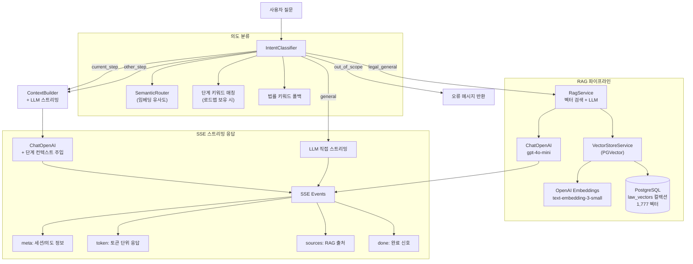

# StepZero RAG 아키텍처

> Last Updated: 2026-03-12

## 1. 개요

StepZero의 AI 채팅 시스템은 **법률/행정 질문은 RAG로, 일반 창업 질문은 LLM 직접 호출로** 처리하는 통합 아키텍처를 사용한다. 사용자의 업종과 로드맵 컨텍스트에 따라 적용되는 법령이 달라지는 특성을 반영하여, SemanticRouter + IntentClassifier 기반 의미 라우팅으로 쿼리를 분류하고 적절한 파이프라인으로 연결한다.

## 2. 핵심 설계 원칙

- **Hybrid Routing**: 임베딩 유사도 기반 SemanticRouter + 키워드 폴백으로 법률/일반/범위외 분류
- **Context-Aware**: 로드맵 보유 사용자는 현재 단계 컨텍스트를 자동 주입
- **단일 엔드포인트**: `/api/v1/chat/stream` SSE로 모든 채팅 유형 통합 처리
- **Safety First**: 범위 외 질문 차단 + Disclaimer 자동 삽입 + 출처 강제 첨부

## 3. 아키텍처 다이어그램



## 4. 핵심 컴포넌트

### 4.1. SemanticRouter (의미 기반 라우팅)

`app/features/rag/application/semantic_router.py`

OpenAI 임베딩 + 코사인 유사도로 쿼리를 3개 카테고리로 분류한다.

| 카테고리 | 임계값 | 앵커 수 | 설명 |
|---------|--------|---------|------|
| `out_of_scope` | 0.75 | 10개 | 세금, 소송, 의료, 투자 등 전문가 영역 |
| `legal` | 0.70 | 8개 | 법률/행정 관련 (허가, 등록, 신고 등) |
| `general` | - | 4개 | 일반 창업 도우미 (기본값) |

**분류 우선순위**: `out_of_scope(0.75)` → `legal(0.70)` → 키워드 폴백 → `general`

**법률 키워드 폴백 세트**:
```
허가, 등록, 신고, 인가, 규정, 법률, 법령, 조례, 면허, 신청,
영업, 위생, 행정심판, 행정조사, 소방, 개인정보, 근로계약, 보험, 세금
```

### 4.2. IntentClassifier (의도 분류기)

`app/features/chat/application/intent_classifier.py`

SemanticRouter 결과에 로드맵 컨텍스트를 결합하여 5개 카테고리로 세분화한다.

| 카테고리 | 조건 | 처리 |
|---------|------|------|
| `out_of_scope` | SemanticRouter out_of_scope | 오류 메시지, 전문가 상담 안내 |
| `current_step` | "이 단계", "현재", "체크리스트" 등 맥락 키워드 | ContextBuilder + LLM (현재 단계 정보 주입) |
| `other_step` | "N단계", "N스텝" 패턴 또는 단계 제목 키워드 | ContextBuilder + LLM (지정 단계 정보 주입) |
| `legal_general` | SemanticRouter legal 또는 법률 키워드 | RAG 벡터 검색 + LLM |
| `general` | 위 조건 모두 미해당 | LLM 직접 호출 |

**단계 매칭 방식** (로드맵 보유 사용자만):
1. 현재 단계 맥락 키워드: `{"이 단계", "지금 단계", "현재", "체크리스트", ...}`
2. 단계 번호 패턴: `(\d+)단계|(\d+)스텝|제(\d+)단계`
3. 단계 제목 키워드 매칭 (제목을 공백 분리하여 비교)

### 4.3. RagService (벡터 검색 서비스)

`app/features/rag/application/rag_service.py`

| 항목 | 설정 |
|------|------|
| 벡터 DB | PGVector (`langchain_postgres.PGVector`) |
| 컬렉션 | `law_vectors` |
| 임베딩 | OpenAI `text-embedding-3-small` |
| LLM | `gpt-4o-mini` |
| 검색 수 | k=5 |
| 메타데이터 | JSONB 형식 (`use_jsonb=True`) |

**검색 결과 메타데이터 구조**:
```python
{
    "id": int,
    "type": meta.get("category", "law"),  # 문서 카테고리
    "title": meta.get("title"),            # 법령명
    "url": meta.get("law_reference")       # 원문 참조
}
```

### 4.4. VectorStoreService (벡터 적재 서비스)

`app/services/vector_store.py`

법령 ETL 파이프라인에서 생성된 데이터를 청킹하여 벡터 DB에 적재한다.

| 항목 | 설정 |
|------|------|
| 청킹 방식 | `RecursiveCharacterTextSplitter` |
| chunk_size | 600 |
| chunk_overlap | 100 |
| 분리자 | `["\n\n", "\n", ".", " "]` |

**벡터 메타데이터 구조**:
```python
{
    "source": "law_etl",
    "title": "식품위생법",
    "category": "영업 인허가",
    "summary": "식품접객업 영업신고 관련...",
    "law_reference": "https://law.go.kr/...",
    "chunk_index": 0,
    "total_chunks": 5
}
```

### 4.5. ChatService (통합 채팅 서비스)

`app/features/chat/application/chat_service.py`

**SSE 스트리밍 방식**으로 모든 채팅 유형을 통합 처리한다.

**SSE 이벤트 타입**:

| 이벤트 | 페이로드 | 설명 |
|--------|---------|------|
| `meta` | 세션 ID, 의도, 단계 정보 | 응답 시작 시 1회 |
| `intent` | 카테고리, 단계 ID/제목 | 의도 분류 결과 |
| `token` | 텍스트 토큰 | 스트리밍 응답 본문 |
| `sources` | RAG 출처 배열 | legal_general 시 출처 정보 |
| `warning` | 경고 메시지 | RAG 미가용 등 폴백 시 |
| `error` | 오류 메시지 | out_of_scope 등 |
| `done` | 메시지 ID | 응답 완료 |

**하트비트**: 15초 주기 SSE 주석 (`: heartbeat\n\n`) 발행으로 연결 유지.

## 5. 데이터 파이프라인

### 5.1. 법령 수집

```
국가법령정보센터 API → fetch_laws.py → law_api_client.py → 원시 JSON
                                                              ↓
                                            law_etl.py → ProcessedLawData
                                                              ↓
                                        seed_rag_vectors.py → VectorStoreService
                                                              ↓
                                                        PGVector (law_vectors)
```

**수집 범위**: 3 Wave, 6개 업종 (식품제조가공업, 통신판매업, 미용업, 일반소매업, 학원업, 숙박업)

### 5.2. ActionKit 연동

로드맵 생성 시 `ActionKitMatcher`가 업종별 관련 법령을 매칭하여 로드맵 스텝에 연결한다.

```
사용자 입력 (업종/지역)
    ↓
ActionKitMatcher → 업종별 카테고리 매핑 (BUSINESS_TYPE_TO_CHAPTER)
    ↓
ActionKitItem 검색 → 관련 법령/체크리스트/파일
    ↓
LLMPersonalizer → 개인화된 로드맵 스텝 생성
```

## 6. 벡터 DB 현황

| 항목 | 값 |
|------|-----|
| 총 벡터 수 | 1,777개 |
| 컬렉션 | `law_vectors` |
| ActionKit 아이템 | 67개 |
| 업종 챕터 | 6개 (chapters 7-12) |
| 임베딩 차원 | 1536 (text-embedding-3-small) |
| 유사도 메트릭 | 코사인 유사도 |

## 7. 안전 장치

| 장치 | 구현 |
|------|------|
| 범위 외 차단 | `out_of_scope` 분류 → 전문가 상담 안내 메시지 |
| 출처 첨부 | `sources` SSE 이벤트로 RAG 출처 강제 전달 |
| 면책 조항 | 프론트엔드 `Disclaimer` 컴포넌트 + 시스템 프롬프트 내 문구 |
| 경고 표시 | RAG 미가용 시 `warning` 이벤트 + `ChatWarningBadge` |
