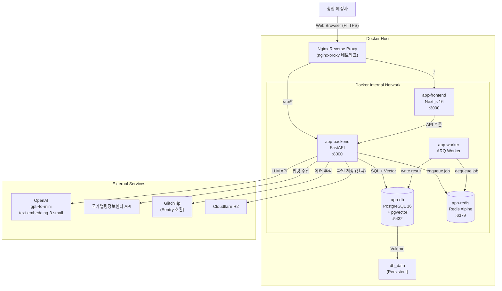
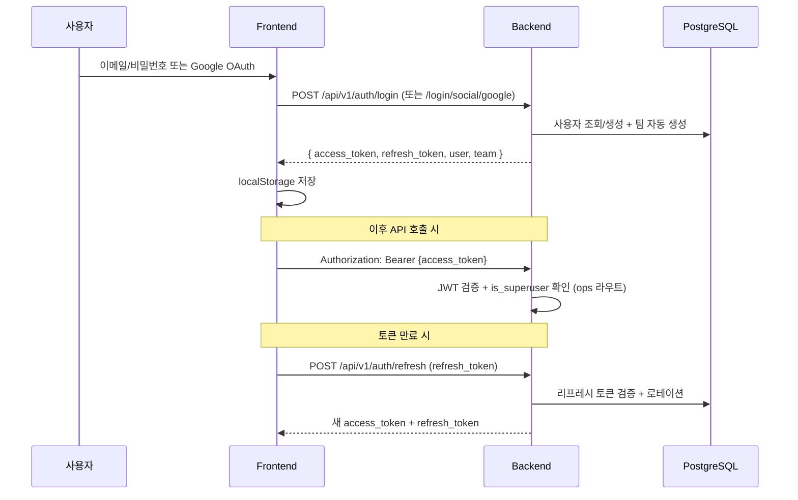
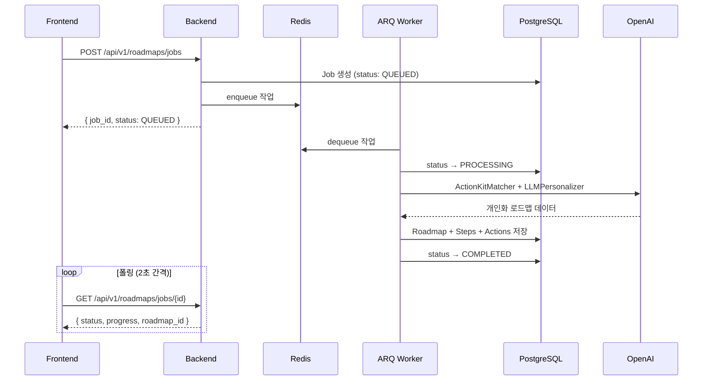
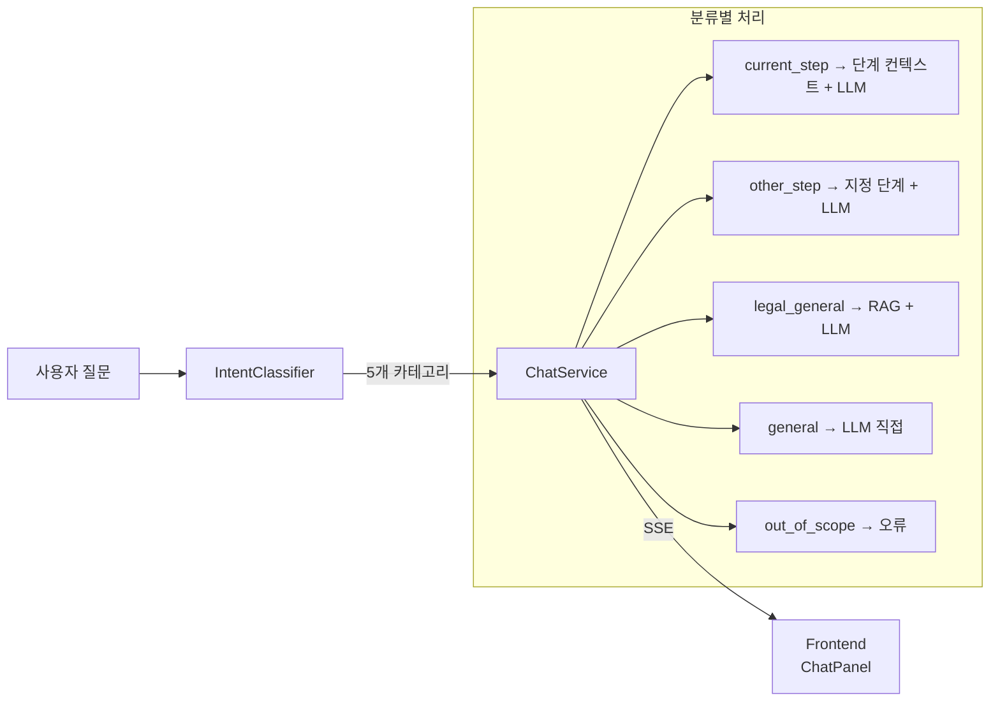

# StepZero 시스템 아키텍처

> Last Updated: 2026-03-12

## 1. 개요

StepZero는 모든 서비스(Frontend, Backend, Worker, DB, Redis)를 **단일 서버 내 Docker Compose**로 통합 배포하는 Monolithic Deployment 아키텍처를 사용한다. 개발 속도와 운영 단순화를 최우선으로 하며, 향후 트래픽 증가 시 각 컴포넌트를 분리할 수 있는 구조를 유지한다.

## 2. 시스템 아키텍처 다이어그램

## 3. 서비스 구성

### 3.1. Frontend (`app-frontend`)

| 항목 | 값 |
|------|-----|
| 프레임워크 | Next.js 16 (App Router) |
| 런타임 | Node.js 24-alpine |
| 패키지 매니저 | pnpm 10.30.3 (Corepack) |
| 빌드 모드 | Standalone Output |
| 포트 | 3000 |
| UI | Radix UI + shadcn/ui + Tailwind CSS 3.3 |
| HTTP | Axios (토큰 인터셉터, silent refresh) |
| 인증 | AuthProvider (`useSyncExternalStore`, 탭 간 동기화) |

### 3.2. Backend (`app-backend`)

| 항목 | 값 |
|------|-----|
| 프레임워크 | FastAPI >=0.135.0 |
| 런타임 | Python 3.13 (uv 0.10) |
| ASGI 서버 | Uvicorn |
| ORM | SQLModel + SQLAlchemy (asyncpg) |
| 마이그레이션 | Alembic (18개 버전) |
| API Prefix | `/api/v1` |
| 포트 | 8000 |

### 3.3. Worker (`app-worker`)

| 항목 | 값 |
|------|-----|
| 프레임워크 | ARQ (Redis 기반 비동기 작업 큐) |
| 런타임 | Python 3.13 (Backend와 동일 이미지) |
| 역할 | 로드맵 비동기 생성 전용 |
| 진입점 | `app.workers.roadmap_worker.WorkerSettings` |

### 3.4. Database (`app-db`)

| 항목 | 값 |
|------|-----|
| 이미지 | pgvector/pgvector:pg16 |
| 역할 | 정형 데이터 (34개 테이블) + 벡터 데이터 (`law_vectors` 1,777벡터) |
| 확장 | pgvector (벡터 유사도 검색) |
| 세션 | 단일 팩토리 `get_session()` (Read/Write 분리 없음) |
| 포트 | 5432 |

### 3.5. Cache/Queue (`app-redis`)

| 항목 | 값 |
|------|-----|
| 이미지 | redis:alpine |
| 역할 | ARQ 작업 큐 + Redis Pub/Sub (실시간 알림) |
| 포트 | 6379 |

## 4. 인증 아키텍처

| 항목 | 구현 |
|------|------|
| 인증 방식 | 이메일/비밀번호 + Google OAuth |
| 토큰 | JWT (access + refresh) |
| 저장 | localStorage + Axios 인터셉터 |
| 팀 컨텍스트 | `X-Team-Id` 헤더 |
| 관리자 | `is_superuser` 플래그 + `require_platform_admin` 의존성 |
| 토큰 보안 | 리프레시 토큰 로테이션 + 재사용 감지 |
| Multi-Tenancy | 가입 시 개인 팀 자동 생성, 모든 데이터 Team UUID 스코프 |

## 5. 비동기 작업 흐름 (로드맵 생성)

## 6. AI 채팅 흐름

상세 RAG 아키텍처는 `rag-architecture.md` 참조.

## 7. 파일 스토리지

| 항목 | 값 |
|------|-----|
| 추상화 | `StorageBackend` 인터페이스 (base.py) |
| 로컬 | `LocalStorage` → `STORAGE_LOCAL_ROOT` 경로 |
| 클라우드 | `R2Storage` → Cloudflare R2 (boto3) |
| 팩토리 | `STORAGE_BACKEND` 환경변수로 선택 (local/r2) |
| ActionKit 정적 | `/api/v1/actionkits/files/` → `uploads/actionkit/` 마운트 |

## 8. 관찰성

| 도구 | 역할 | 설정 |
|------|------|------|
| structlog | 구조화 JSON 로깅 | `app/core/logging.py` |
| Sentry SDK | 에러 추적 | GlitchTip 호환, `SENTRY_DSN` |
| slowapi | Rate Limiting | `app/core/rate_limit.py` |
| Request Logging | 요청 컨텍스트 | `app/middleware/logging.py` |

## 9. 개발 vs 프로덕션

| 항목 | 개발 (`docker-compose.dev.yml`) | 프로덕션 (`docker-compose.prod.yml`) |
|------|------|------|
| Dockerfile | `Dockerfile` (--extra dev) | `Dockerfile.prod` (--no-dev) |
| 재시작 | 없음 | `restart: unless-stopped` |
| 핫 리로드 | `--reload` + 볼륨 마운트 | 없음 |
| Healthcheck | interval=5s, retries=5 | interval=10s, retries=10 |
| 포트 노출 | DB 5432, Redis 6379, BE 8000, FE 3000 | nginx 경유 |

**환경 파일 우선순위**: `.env` → `.env.local` → `.env.docker.local`

## 10. 확장 전략

### 현재 (MVP)

- 단일 VPS에 Docker Compose 배포
- 1 User = 1 Team (개인 앱 UX)
- 단일 DB 세션 (Read/Write 분리 없음)

### 향후 확장 포인트

| 컴포넌트 | 현재 | 확장 시 |
|---------|------|--------|
| DB | 단일 인스턴스 | Read Replica 분리 |
| Worker | 단일 프로세스 | 수평 확장 (ARQ 다중 워커) |
| 스토리지 | 로컬/R2 혼용 | R2 전환 |
| 프록시 | nginx-proxy 네트워크 | 전용 Nginx 컨테이너 + SSL |
| 팀 | 1인 팀 자동 생성 | 초대/협업 기능 추가 |

## 11. 성능 목표 (Core Web Vitals)

| 지표 | 목표 | 현재 달성 |
|------|------|----------|
| LCP | < 2000ms | 통과 |
| FCP | < 1000ms | 통과 |
| CLS | < 0.1 | 통과 |
| TTI | < 2500ms | 통과 |
| TBT | < 300ms | 통과 |
