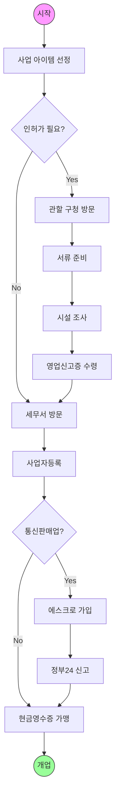
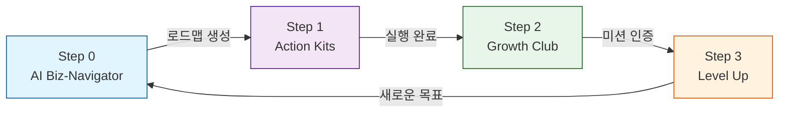
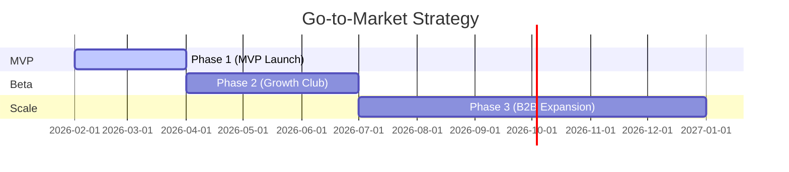

# StepZero
## AI-Driven Startup Navigator & Growth Platform

<div class="absolute bottom-10 left-10">
  <div class="opacity-50 text-sm">
    Project Presentation
  </div>
</div>

<!--
Presenter Note:
- 오프닝
- StepZero: "창업의 0단계부터 함께한다"
- AI-Driven: 단순 정보 제공이 아닌, 실행 로드맵 생성
-->

---
layout: quote
---

# "창업, 도대체 뭐부터 해야 하죠?"

<div class="mt-8">
  <div v-click class="text-xl mb-4 italic op-80">
    "사업자등록은 어디서 하는 거예요?"
  </div>
  <div v-click class="text-xl mb-4 italic op-80">
    "통신판매업 신고를 먼저 해야 하나요, 인허가를 먼저 받나요?"
  </div>
  <div v-click class="text-xl mb-8 italic op-80">
    "인터넷 정보가 너무 많아서 뭘 믿어야 할지 모르겠어요."
  </div>

  <div v-click class="text-2xl font-bold text-red-500 mt-12">
    → 매년 150만 명이 똑같은 질문을 합니다.
  </div>
</div>

<!--
Presenter Note:
- Hook: 실제 예비 창업자들의 질문
- 문제의 보편성 강조 (150만 명)
-->

---
layout: default
---

# The "Zero" Gap

초기 창업자가 겪는 **3가지 고통 (Pain Points)**

<div class="grid grid-cols-3 gap-8 mt-12">
  <div v-click class="text-center p-4 border border-gray-200 rounded-lg">
    <div class="text-6xl mb-4">🌊</div>
    <div class="text-xl font-bold mb-2">Information Overload</div>
    <div class="text-sm opacity-75">
      정보 감옥.<br>검색 결과는 100개인데<br>정답은 0개입니다.
    </div>
  </div>

  <div v-click class="text-center p-4 border border-gray-200 rounded-lg">
    <div class="text-6xl mb-4">😨</div>
    <div class="text-xl font-bold mb-2">Analysis Paralysis</div>
    <div class="text-sm opacity-75">
      분석 마비.<br>선택지가 너무 많아<br>실행을 미루게 됩니다.
    </div>
  </div>

  <div v-click class="text-center p-4 border border-gray-200 rounded-lg">
    <div class="text-6xl mb-4">🏝️</div>
    <div class="text-xl font-bold mb-2">Isolation</div>
    <div class="text-sm opacity-75">
      고립감.<br>모든 결정을 혼자<br>책임져야 합니다.
    </div>
  </div>
</div>

---
layout: center
---

# 복잡한 창업의 미로



<div class="text-center mt-4 font-bold text-red-500">
  이 모든 과정을 혼자 알아내야 합니다.
</div>

---
layout: statement
---

# Solution

<div v-click>
  StepZero가<br>
  복잡한 창업 절차를<br>
  <span v-mark.circle.red="1">당신만의 내비게이션</span>으로<br>
  바꿔드립니다.
</div>

---
layout: default
---

# The Growth Loop

실행 중심의 선순환 구조



<div class="mt-8 grid grid-cols-4 gap-4 text-center text-sm">
  <div v-click>
    <strong>Planning</strong><br>AI가 최적의 경로 제안
  </div>
  <div v-click>
    <strong>Doing</strong><br>서류/가이드 즉시 제공
  </div>
  <div v-click>
    <strong>Connecting</strong><br>동료와 함께 실행 인증
  </div>
  <div v-click>
    <strong>Rewarding</strong><br>성취감과 실질적 혜택
  </div>
</div>

---
layout: two-cols
---

# 1. AI Biz-Navigator

**개인화된 창업 로드맵 자동 생성**

<div v-click class="mt-4">
  <ul class="list-disc ml-4 space-y-2">
    <li>
      <strong>LLM + RAG Engine</strong><br>
      사용자의 아이템/상황을 분석하여<br>법령에 기반한 정확한 절차 생성
    </li>
    <li>
      <strong>Dynamic Roadmap</strong><br>
      진행 상황에 따라 실시간으로<br>다음 할 일(Next Step) 재설계
    </li>
    <li>
      <strong>Zero Hallucination</strong><br>
      국가법령정보센터 DB 검증
    </li>
  </ul>
</div>

::right::

<div class="ml-4 p-4 bg-gray-50 rounded-lg border border-gray-200 h-full flex items-center justify-center">
  <!-- UI Mockup Placeholder -->
  <div class="text-center text-gray-400">
    <div class="text-4xl mb-2">🗺️</div>
    <div>UI Mockup</div>
    <div class="text-xs">Roadmap View</div>
    <div class="mt-4 text-xs text-left bg-white p-2 rounded shadow-sm border">
      1. 영업신고 (D-10)<br>
      2. 사업자등록 (D-7)<br>
      3. 통신판매업 (D-3)
    </div>
  </div>
</div>

---
layout: two-cols
---

# 2. Action Kits & Legal Chatbot

**실행을 위한 도구 상자**

<div class="mt-4">
  <h3 class="font-bold text-blue-600">Action Kits</h3>
  <ul class="list-disc ml-4 text-sm mb-4">
    <li>절차별 필수 서류 리스트 (체크리스트)</li>
    <li>관공서 서식 HWP/PDF 원클릭 다운로드</li>
    <li>작성 예시 가이드 제공</li>
  </ul>

  <h3 class="font-bold text-green-600">Legal Chatbot</h3>
  <ul class="list-disc ml-4 text-sm">
    <li>"이거 불법 아닌가요?" 즉시 답변</li>
    <li>관련 법령 조문 링크 제공</li>
  </ul>
</div>

::right::

<div class="ml-4 mt-8">
  <div class="bg-blue-50 p-3 rounded mb-4 text-sm">
    <strong>🤖 AI Chatbot</strong><br>
    "반려동물 간식은 '사료제조업' 등록이 필요합니다. (사료관리법 제12조)"
  </div>
  
  <div class="bg-white p-3 rounded border shadow-sm text-sm">
    <strong>📋 Checklist</strong>
    <ul class="list-none mt-1">
      <li>✅ 임대차계약서 사본</li>
      <li>⬜ 시설배치도 (다운로드)</li>
      <li>⬜ 제조시설 설명서</li>
    </ul>
  </div>
</div>

---
layout: image-right
image: https://source.unsplash.com/random/800x600/?team,work
---

# 3. Growth Club

**함께 달리는 동료들 (Cohort System)**

<div class="mt-8">
  <ul class="list-disc ml-4 space-y-4">
    <li v-click>
      <strong>기수제 운영 (Batch)</strong><br>
      비슷한 단계의 창업자를 그룹핑<br>
      (예: '24년 2월 예비창업 3기')
    </li>
    <li v-click>
      <strong>미션 인증 (Challenge)</strong><br>
      "사업자등록증 인증샷 올리기"<br>
      서로의 실행을 독려하고 축하
    </li>
    <li v-click>
      <strong>Peer Review</strong><br>
      서로의 아이템에 대한 피드백<br>
      가장 솔직한 초기 고객
    </li>
  </ul>
</div>

---
layout: default
---

# Demo Scenario

**"멍멍냠냠" (반려동물 수제 간식) 창업하기**

<div class="mt-8 space-y-4">
  <div v-click class="flex items-center gap-4 p-3 bg-blue-50 rounded">
    <div class="font-bold text-blue-600 w-24">Step 0</div>
    <div>키워드 입력: "반려동물 수제 간식" → AI가 로드맵 생성 (사료제조업 → 성분등록 → ...)</div>
  </div>
  
  <div v-click class="flex items-center gap-4 p-3 bg-purple-50 rounded">
    <div class="font-bold text-purple-600 w-24">Step 1</div>
    <div>"사료제조업 등록" 클릭 → 시설기준 체크리스트 확인 & 구청 제출 서류 다운로드</div>
  </div>
  
  <div v-click class="flex items-center gap-4 p-3 bg-green-50 rounded">
    <div class="font-bold text-green-600 w-24">Step 2</div>
    <div>Growth Club 매칭 → 시설 공사 사진 업로드 & 동료들의 응원 댓글</div>
  </div>
  
  <div v-click class="flex items-center gap-4 p-3 bg-yellow-50 rounded">
    <div class="font-bold text-yellow-600 w-24">Step 3</div>
    <div>등록증 수령 인증 → 'Seed' 레벨 달성 → 마케팅 가이드(Next Step) 잠금 해제</div>
  </div>
</div>

---
layout: default
---

# Technical Architecture

High Reliability RAG Pipeline

```mermaid {scale: 0.8}
flowchart LR
    Sources[Data Sources] -->|Crawling| VectorDB[(Vector DB)]
    Sources -->|Law/Notice| VectorDB
    
    User[User Question] -->|Embedding| Search[Semantic Search]
    VectorDB --> Search
    
    Search -->|Top-k Documents| Context[Context Window]
    User -->|Prompt| LLM[LLM (GPT-4)]
    Context --> LLM
    
    LLM -->|Fact Check| Critic[Validator Agent]
    Critic -->|Verified| Answer[User Response]
    
    style VectorDB fill:#f9f,stroke:#333
    style LLM fill:#ff9,stroke:#333
```

- **Reliability**: 국가법령정보센터, K-Startup 공고 데이터만 학습
- **Update**: 매일 최신 공고/법령 업데이트 (Airflow)

---
layout: fact
---

# Market Opportunity

거대한 잠재 시장 (Total Addressable Market)

<div class="grid grid-cols-3 gap-8 mt-12 text-center">
  <div v-click>
    <div class="text-sm opacity-60 mb-2">TAM (연간 신규 사업자)</div>
    <div class="text-5xl font-bold text-blue-600">100만+</div>
    <div class="text-sm mt-2">건/년</div>
  </div>

  <div v-click>
    <div class="text-sm opacity-60 mb-2">SAM (소상공인/1인창업)</div>
    <div class="text-5xl font-bold text-green-600">40만</div>
    <div class="text-sm mt-2">건/년</div>
  </div>
  
  <div v-click>
    <div class="text-sm opacity-60 mb-2">SOM (초기 타겟)</div>
    <div class="text-5xl font-bold text-purple-600">2만</div>
    <div class="text-sm mt-2">명 (5%)</div>
  </div>
</div>

<div class="text-center mt-12 opacity-60 text-sm">
  *출처: 국세청 국세통계연보 (2023 신규 사업자 현황)
</div>

---
layout: center
---

# Competitive Positioning

<div class="relative w-[500px] h-[400px] mx-auto border-l-2 border-b-2 border-gray-400">
  <!-- Axis Labels -->
  <div class="absolute -left-12 top-1/2 -rotate-90 text-sm font-bold">Community Density</div>
  <div class="absolute bottom-[-2rem] left-1/2 -translate-x-1/2 text-sm font-bold">AI Automation</div>
  
  <!-- Quadrants -->
  <div class="absolute top-10 left-10 text-gray-400 text-xs">Humans</div>
  <div class="absolute bottom-10 right-10 text-gray-400 text-xs">Tech</div>

  <!-- Competitors -->
  <div class="absolute bottom-4 left-4 text-xs bg-gray-200 px-2 py-1 rounded">
    블로그/카페<br>(파편화)
  </div>
  
  <div class="absolute top-4 left-4 text-xs bg-gray-200 px-2 py-1 rounded">
    창업 커뮤니티<br>(정보부정확)
  </div>
  
  <div class="absolute bottom-4 right-4 text-xs bg-gray-200 px-2 py-1 rounded">
    ChatGPT<br>(할루시네이션)
  </div>

  <!-- StepZero -->
  <div v-click class="absolute top-4 right-4 flex flex-col items-center">
    <div class="text-4xl text-blue-600 font-bold mb-1">StepZero</div>
    <div class="text-xs bg-blue-100 text-blue-800 px-2 py-1 rounded border border-blue-400 shadow-lg">
      Tech + Community
    </div>
    <div v-mark.circle.orange class="absolute w-32 h-20 -top-2"></div>
  </div>
</div>

---
layout: two-cols
---

# Business Model

**지속 가능한 수익 구조**

<div class="mt-8 space-y-6">
  <div v-click>
    <h3 class="font-bold text-xl">1. Freemium (구독)</h3>
    <p class="text-sm opacity-75">Basic: 무료 / Pro: 월 9,900원</p>
    <p class="text-xs opacity-50">심화 로드맵, 전문가 챗봇 무제한</p>
  </div>

  <div v-click>
    <h3 class="font-bold text-xl">2. B2B Commission</h3>
    <p class="text-sm opacity-75">전문가 매칭 수수료</p>
    <p class="text-xs opacity-50">세무/노무/인테리어 파트너 연결</p>
  </div>

  <div v-click>
    <h3 class="font-bold text-xl">3. Gov. Matching</h3>
    <p class="text-sm opacity-75">지원사업안내/대행</p>
    <p class="text-xs opacity-50">성공 보수 및 컨설팅 비</p>
  </div>
</div>

::right::

<div class="mt-8 ml-8">
  <h3 class="font-bold mb-4">3-Year Revenue Projection</h3>
  <div class="relative h-64 w-full border-l border-b border-gray-300">
    <div class="absolute bottom-0 left-4 w-12 h-10 bg-blue-200"></div>
    <div class="absolute bottom-0 left-20 w-12 h-24 bg-blue-400"></div>
    <div class="absolute bottom-0 left-36 w-12 h-48 bg-blue-600"></div>
    
    <div class="absolute bottom-[-1.5rem] left-4 text-xs">Y1</div>
    <div class="absolute bottom-[-1.5rem] left-20 text-xs">Y2</div>
    <div class="absolute bottom-[-1.5rem] left-36 text-xs">Y3</div>
  </div>
  <div class="text-center mt-8 font-bold text-blue-600">
    Scale-up with Data
  </div>
</div>

---
layout: default
---

# Execution Roadmap & KPI



<div class="grid grid-cols-3 gap-4 mt-8">
  <div class="p-4 bg-gray-50 rounded text-center">
    <div class="font-bold mb-2">Phase 1</div>
    <div class="text-xs">로드맵 생성 5,000건<br>MAU 1,000</div>
  </div>
  <div class="p-4 bg-blue-50 rounded text-center border border-blue-200">
    <div class="font-bold mb-2">Phase 2</div>
    <div class="text-xs">Growth Club 50개<br>완주율 30%</div>
  </div>
  <div class="p-4 bg-gray-50 rounded text-center">
    <div class="font-bold mb-2">Phase 3</div>
    <div class="text-xs">월 매출 1,000만원<br>파트너사 20곳</div>
  </div>
</div>

---
layout: default
---

# Team StepZero

**기술과 경험을 겸비한 팀**

<div class="grid grid-cols-3 gap-8 mt-12">
  <div v-click class="text-center">
    <div class="w-24 h-24 bg-gray-300 rounded-full mx-auto mb-4 overflow-hidden">
      <!--  -->
      <div class="w-full h-full flex items-center justify-center text-4xl">👨‍💻</div>
    </div>
    <h3 class="font-bold text-lg">김종만 (CEO)</h3>
    <p class="text-sm text-blue-600">Full-stack Dev</p>
    <p class="text-xs mt-2 opacity-75">
      전) OO 테크 리드<br>
      창업 경험 2회
    </p>
  </div>

  <div v-click class="text-center">
    <div class="w-24 h-24 bg-gray-300 rounded-full mx-auto mb-4 overflow-hidden">
      <div class="w-full h-full flex items-center justify-center text-4xl">👩‍💼</div>
    </div>
    <h3 class="font-bold text-lg">이영희 (COO)</h3>
    <p class="text-sm text-green-600">Operations</p>
    <p class="text-xs mt-2 opacity-75">
      전) XX 엑셀러레이터<br>
      스타트업 100팀 보육
    </p>
  </div>
  
  <div v-click class="text-center">
    <div class="w-24 h-24 bg-gray-300 rounded-full mx-auto mb-4 overflow-hidden">
      <div class="w-full h-full flex items-center justify-center text-4xl">🤖</div>
    </div>
    <h3 class="font-bold text-lg">AI Agent</h3>
    <p class="text-sm text-purple-600">Core Engine</p>
    <p class="text-xs mt-2 opacity-75">
      24/7 가동<br>
      법령 마스터
    </p>
  </div>
</div>

---
layout: statement
---

# Vision

<div v-click class="text-3xl leading-relaxed">
  우리는<br>
  <strong>Step 1</strong> 이전의<br>
  모든 두려움을 해결합니다.
</div>

---
layout: end
---

# StepZero

지금, 당신의 창업을 시작하세요.

<div class="mt-8">
  <p class="text-lg">📧 contact@stepzero.io</p>
</div>

<div class="mt-12 text-sm opacity-50">
  Q & A
</div>
