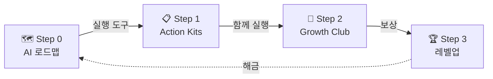
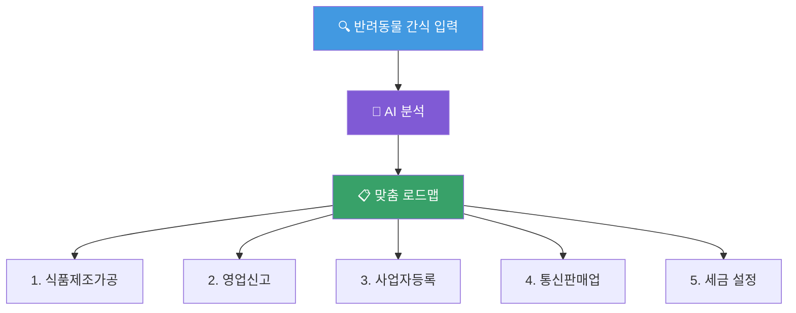

# **StepZero**

AI 기반 창업 네비게이터 & 성장 플랫폼

창업 경진대회 발표

<!--
안녕하세요. StepZero를 소개하겠습니다.
Step 1 이전의 모든 막막함을 해결하는, AI 기반 창업 네비게이터입니다.
-->

---
layout: quote
---

# "창업하고 싶은데, 뭐부터 해야 하죠?"

"사업자등록은 어디서 하는 거예요?"

"통신판매업 신고가 먼저인가요, 사업자등록이 먼저인가요?"

"인터넷에 다 다르게 나와있는데 뭘 믿어야 하죠?"

→ 매년 118만 명이 이 질문을 합니다.

<!--
이 질문들, 네이버 지식인과 창업 카페에서 매일 올라오는 실제 질문들입니다.
매년 118만 명의 새로운 사장님이 탄생하지만, 대부분이 이런 기초적인 질문에서부터 막힙니다.
-->

---

# 초기 창업자의 3가지 고통

"창업 5년 후, 10곳 중 7곳은 문을 닫습니다"

<v-clicks>

🔍

정보의 홍수

검색 결과 100개, 정답 0개. "카더라" 정보가 판을 친다

🛡️

신뢰의 부재

블로그마다 다른 말, 법령 원문은 읽기 어렵다

😰

실행의 고립

혼자서 모든 결정을 내려야 하는 막막함

</v-clicks>

<strong>1년 생존율 78%</strong> → <strong class="text-red-600">5년 생존율 29.2%</strong> — 준비 부족이 급격한 붕괴를 만듭니다

<!--
국내 창업기업 5년 생존율은 29.2%입니다.
1년 차에는 78%가 살아남지만, 3~5년 차에 급격히 무너집니다.
왜? 준비가 부족한 채로 시작하기 때문입니다. 이 3가지가 핵심 원인입니다.
-->

---
layout: center
---

# 창업 절차의 미로

이걸 혼자 알아내야 합니다. 그것도 처음으로.

💡 아이디어

→

업종 선택

→

사업자등록

↓ 업종별로 갈라지는 인허가 절차들...

식품제조 가공 허가

통신판매업 신고

영업 신고

위생 교육

관청 방문

서류 준비

세금 신고

↓ 각각의 절차마다 또다시...

관할 관청 확인

필요 서류 목록 파악

HWP 양식 다운로드

작성법 검색

방문 예약 및 제출

🤯 어디까지 했더라?

한 사람이 이 모든 걸 혼자 검색하고, 판단하고, 실행해야 합니다

<!--
실제로 카페 창업 하나 하려면 이 정도 절차를 거쳐야 합니다.
경험 없는 예비 창업자에게는 미로와 같죠. 중간에 길을 잃기 쉽습니다.
-->

---
layout: statement
transition: fade
---

# StepZero가 복잡한 창업 절차를 당신만의 내비게이션으로 바꿔드립니다

Step 1 이전의 모든 막막함을 해결하는 AI 파트너

<!--
네이버 지도가 길을 알려주듯, StepZero는 창업의 길을 알려줍니다.
AI가 '지금 당장 해야 할 일'을 순서대로 정리해줍니다.
-->

---

# The Growth Loop — 서비스 구조

AI 로드맵 기반의 선순환 성장 모델

<v-clicks>

<strong>Step 0 — AI Biz-Navigator</strong> 
창업 주제만 입력 → 맞춤형 절차 로드맵 자동 생성

<strong>Step 1 — Action Kits</strong> 
절차별 체크리스트, 서류 양식, 작성 가이드 제공

<strong>Step 2 — Growth Club</strong> 
같은 단계 창업자 자동 매칭, 미션 인증으로 함께 완주

<strong>Step 3 — 레벨업</strong> 
달성률 → 레벨 상승 → 투자/마케팅 정보, 제휴 혜택

</v-clicks>

<!--
StepZero의 핵심 구조입니다. 단순히 정보를 던져주는 게 아니라,
로드맵 생성 → 실행 도구 → 커뮤니티 → 보상까지 하나의 선순환 루프를 만듭니다.
사용자가 이탈할 이유를 없애는 구조입니다.
-->

---
layout: two-cols
---

# AI Biz-Navigator

핵심 엔진

<v-clicks>

🎯

<strong>"반려동물 수제 간식"</strong> 입력 → 맞춤 로드맵 즉시 생성

📚

<strong>LLM + RAG</strong> 기반 법령·공고문 원문에서 답을 찾음

✅

<strong>"카더라" 정보 Zero</strong> 출처가 명확한 가이드만 제공

</v-clicks>

::right::

<!--
핵심 엔진입니다. 사용자가 창업 아이템만 입력하면,
AI가 법인 설립부터 영업신고까지의 전체 절차를 나만의 로드맵으로 자동 생성합니다.
중요한 건 RAG 기술로 법령 원문에 기반한다는 점입니다. 할루시네이션이 아닌 팩트입니다.
-->

---
layout: two-cols
---

# Action Kits

바로 실행 가능한 도구

<v-clicks>

✅ 체크리스트

사업자등록에 필요한 모든 준비물

📄 서류 양식

관공서 제출용 HWP/PDF 양식 제공

📝 작성 가이드

항목별 작성 예시 및 주의사항

</v-clicks>

::right::

# Legal Chatbot

법령 기반 Q&A

Q

"통신판매업 신고는 어디서 하나요?"

A (StepZero AI)

「전자상거래법」 제12조에 따라 <strong>관할 시·군·구청</strong>에 신고합니다.

📎 출처: 전자상거래 등에서의 소비자보호에 관한 법률

<strong>핵심 차별점:</strong> 
출처 원문 링크 제공 + 팩트체크 레이어로 할루시네이션 방지

<!--
로드맵의 각 노드를 클릭하면 바로 쓸 수 있는 도구가 나옵니다.
그리고 궁금한 점은 법령 기반 챗봇이 즉시 답변합니다.
ChatGPT와의 차이점은 한국 법령 원문을 근거로 답한다는 것입니다.
-->

---

# Growth Club — 혼자가 아닌, 함께 완주

AI가 해결할 수 없는 정서적 지지와 실전 팁은 커뮤니티가 보완합니다

<v-clicks>

🎯

자동 매칭

같은 업종 + 같은 단계의 창업자끼리 기수제 그룹핑

📸

미션 인증

절차 완료 인증샷 업로드 → 동료 피드백 → 미션 클리어

🏅

성장 인증서

챌린지 완주 시 공식 인증서 발급

</v-clicks>

💡 Cold Start 방지 → 초기 '소수 정예' 클럽 운영으로 <strong>밀도 높은 상호작용</strong> 유도

<!--
AI만으로는 부족합니다. 혼자 하면 포기하기 쉬운 과정을,
같은 단계의 동료들과 미션을 수행하며 함께 완주합니다.
이것이 StepZero의 리텐션 핵심입니다.
-->

---

# 데모 시나리오 — "반려동물 수제 간식 창업"

<v-switch>

<template #1>

STEP 0 — AI 로드맵 생성

"반려동물 간식" 입력 → AI가 분석 → 맞춤 로드맵 생성

1️⃣ 식품제조가공 허가

2️⃣ 영업신고

3️⃣ 사업자등록

4️⃣ 통신판매업 신고

5️⃣ 세금 체계 설정

</template>

<template #2>

STEP 1 — Action Kit 실행

"식품제조가공업 허가" 클릭 →

✅ 준비물 체크리스트

☐ 영업장 도면 (1부)

☐ 위생교육 수료증

☐ 건강진단서

☐ 제조시설 배치도

📍 실행 가이드

관할: OO구청 위생과

처리 기간: 약 10일

수수료: 28,000원

</template>

<template #3>

STEP 2 — Growth Club 참여

같은 단계 창업자 5명과 자동 매칭

👩‍🍳

민지님 · 디저트 카페

식품제조 준비 중

👨‍💼

준호님 · 건강식품

위생교육 완료!

👩‍💻

서연님 · 펫 간식

서류 접수 완료 📸

"저도 위생교육 다녀왔어요!" — 인증샷 공유 & 피드백

</template>

<template #4>

STEP 3 — 레벨업

미션 완료 → Level 2 달성!

🏆 달성 현황

✅ 식품제조가공 허가 — 완료

🔓 영업신고 — 다음 단계 해금

🔒 사업자등록

🔒 통신판매업 신고

🎁 해금된 혜택

📦 포장재 업체 10% 할인

📋 영업신고 심화 가이드

👥 선배 창업자 멘토링 1회

</template>

</v-switch>

<!--
[클릭1] 반려동물 간식으로 창업하고 싶다고 입력하면, AI가 맞춤 로드맵을 만들어줍니다.
[클릭2] 첫 번째 절차를 클릭하면 바로 실행 가능한 체크리스트가 나옵니다.
[클릭3] 같은 단계의 동료들과 함께 미션을 수행하고...
[클릭4] 완료하면 레벨업과 함께 다음 단계와 혜택이 해금됩니다.
-->

---

# 기술 아키텍처

RAG 기반 신뢰성 엔진

📥 데이터 수집

📜 국가법령

📋 K-Startup

📄 관공서DB

→

🤖 AI 파이프라인

크롤러

→

벡터DB

→

LLM

→

팩트체크

→

💡 Output

🗺️ 로드맵

💬 챗봇

📋 Kits

<strong>데이터 출처</strong> 
국가법령정보센터 + K-Startup 공고 + 관공서 서류 DB

<strong>신뢰성 장치</strong> 
RAG + 팩트체크 레이어 — 출처 원문 링크 제공

<strong>포지셔닝</strong> 
법률 자문 ✕ → 정보 가이드 ○ (면책 구조)

<!--
기술 구조입니다. 국가법령정보센터와 K-Startup 공고를 수집하여 벡터 DB에 저장하고,
LLM이 이를 기반으로 로드맵을 생성합니다. 핵심은 팩트체크 레이어입니다.
AI가 만든 답변을 원문과 대조하여 정확성을 보장합니다.
또한 법률 자문이 아닌 정보 가이드로 포지셔닝하여 법적 리스크를 관리합니다.
-->

---
layout: fact
---

# 시장 기회

118만 명 /년

TAM — 연간 신규 창업자 수

중소벤처기업부 2024년 창업기업동향 | 생계형 창업 전년 대비 8.0% 증가

65만 명

SAM — 생계형 · 소자본 '나홀로 사장님'

개인서비스 · 도소매 · 숙박음식업 등 소상공인 비중 55~60%

2만 명 → 월 2억 원

SOM — 1.5년 내 점유 3% 목표

2만 명 × Pro 멤버십 월 9,900원

<!--
118만 명이라는 거대한 파도가 매년 밀려옵니다.
이 중 고가 컨설팅을 받기 어렵고 직접 발로 뛰어야 하는 65만 명이 우리의 1차 타겟입니다.
그 중 3%인 2만 명만 확보해도 월 매출 2억 원이 발생합니다.
-->

---
layout: center
---

# 경쟁 포지셔닝

| | **커뮤니티 약함** | **커뮤니티 강함** |
|---|---|---|
| **AI·신뢰성 높음** | ChatGPT, Claude | **✦ StepZero** |
| | <small class="text-gray-400">즉각 답변, 한국 행정 모름</small> | <small class="text-blue-600">RAG 신뢰성 + 함께 실행</small> |
| **AI·신뢰성 낮음** | K-Startup, 정부포털 | 네이버 카페/블로그 |
| | <small class="text-gray-400">신뢰 100%, UI/UX 불편</small> | <small class="text-gray-400">"카더라" 정보, 광고 홍수</small> |

StepZero는 <strong>"신뢰할 수 있는 AI"</strong> + <strong>"함께하는 커뮤니티"</strong>를 동시에 가진 <strong>유일한 솔루션</strong>

<!--
기존 솔루션들을 두 가지 축으로 나눠봤습니다.
ChatGPT는 빠르지만 한국 행정을 모릅니다. 네이버 카페는 커뮤니티는 있지만 정보가 부정확합니다.
정부 포털은 정확하지만 불편합니다. StepZero만이 두 가지를 동시에 만족시킵니다.
-->

---
layout: two-cols
---

# 수익 모델

커피 2잔 값으로 '창업 비서' 고용

<v-clicks>

① Pro 멤버십 월 9,900원

심화 로드맵 무제한 + 전문가 AI 챗봇 + 지원사업 알림

🎯 메인 수익

② 전문가 매칭 수수료 건당 10~20%

AI 초안 기반 → 전문가 리소스 절감 (Win-Win)

📈 확장 수익

③ 지원사업 매칭 연결 수수료

업종/연차 맞춤 정부 지원사업 실시간 알림

🚀 Phase 3

</v-clicks>

::right::

경쟁 서비스 가격 비교

| 서비스 | 가격 | StepZero |
|--------|------|----------|
| 자비스 | 월 3.3만~ | 기본 **무료** |
| 캐시노트 | 월 1.65만~ | **월 9,900원** |
| 숨고 | 건당 ~98만 | **건당 5~10만** |
| 로톡 | 15분 2~3만 | **AI 무제한** |

<strong>SOM 2만 명 달성 시</strong> 
월 매출 약 2억 원

<!--
수익 모델의 핵심은 Pro 멤버십 월 9,900원입니다.
커피 2잔 값으로 창업 비서를 고용하는 셈이죠.
경쟁사 대비 가격을 보시면, 자비스 3.3만 원, 숨고 컨설팅 98만 원 대비 압도적으로 합리적입니다.
전문가 매칭은 AI가 초안을 잡아주므로 전문가의 단순 상담 시간이 줄어 Win-Win입니다.
-->

---

# 실행 로드맵 & KPI

Phase 1 — MVP

1~2개월

🤖 AI 로드맵 엔진

💬 행정 챗봇 (RAG)

👥 기본 커뮤니티

🎯 KPI

MAU <strong>1,000</strong>

로드맵 <strong>5,000건</strong>

Phase 2 — Beta

3~4개월

📸 미션 인증 시스템

🎯 Growth Club 매칭

📋 지원사업 가이드

🎯 KPI

MAU <strong>5,000</strong> · 완주율 <strong>30%</strong>

Growth Club <strong>50개</strong>

Phase 3 — 확장

5개월~

📄 OCR 서류 자동 분석

🧠 멀티 에이전트

🤝 Partner Marketplace

🎯 KPI

MAU <strong>20,000</strong>

월 매출 <strong>2억 원</strong>

<!--
3단계 로드맵입니다.
1~2개월 내 MVP를 출시하여 MAU 1,000명을 확보하고,
4개월차에 미션 시스템과 커뮤니티를 도입합니다.
5개월차부터 OCR, 멀티 에이전트 등으로 확장하며 월 매출 2억 원을 목표로 합니다.
-->

---

# 중장기 비전 — Business OS로의 확장

창업 완료 후에도 이탈하지 않는 플랫폼

🏢

Business OS

세무 알림 (부가세/종소세) 
노무 관리 (근로계약서 자동생성) 
지원사업 실시간 매칭

👑

Prime Growth Club

POS 매출 분석 스터디 
위기 탈출 SOS 멘토링 
실질적 문제 해결 커뮤니티

🤝

Partner Marketplace

세무사/노무사 검증 매칭 
로드맵 이수자 대상 바우처 
B2B 수익 확대

* Phase 1 & 2에서 유저 리텐션을 확보한 후, Phase 3 이후 순차 도입

<!--
창업이 끝나면 사용자가 이탈할 수 있습니다.
이를 방지하기 위해 사장님이 매월 챙겨야 할 반복 업무를 AI가 관리해주는 Business OS로 확장합니다.
장기적으로는 검증된 전문가를 연결하는 Partner Marketplace로 B2B 수익을 만듭니다.
-->

---
layout: statement
transition: fade
---

# StepZero의 목표는 창업 5년 생존율을 10%p 올리는 것입니다

29%에서 39%로. 10곳 중 3곳이 아닌 4곳이 살아남게.

"모든 예비 창업자의 출발선을 평등하게"

<!--
현재 29%인 5년 생존율을 39%로 올리는 것.
10곳 중 3곳이 살아남는 세상에서, 4곳이 살아남게 만드는 것.
그것이 StepZero의 목표입니다.
-->

---
layout: end
---

# 감사합니다

**StepZero** — Step 1 이전의 모든 막막함을 해결합니다

Q&A

